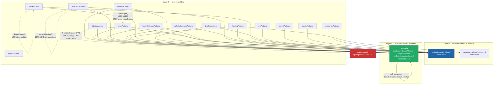

# Store & State-Flow Audit

**Task:** P1-02 · **Measured:** 2026-08-16 · **Scope:** `client/src/store/` (17 files, 8,050 LOC),
`client/src/types/index.ts`, `client/src/services/{api,autoSave}.ts`, and all 35 files importing
`useEditorStore`.

---

## Summary

**The single most important structural fact this audit uncovered: `EditorState` is not the only
state container. There are three, and only one of them is the Zustand store.**

| Container | Where | Size | Persisted? | In history? |
| --- | --- | --- | --- | --- |
| `EditorState` (Zustand root) | `store/storeTypes.ts:74-441` | **21 data fields** + **162 actions** | No (except `project`) | No |
| `Project.uiState` (nested, inside DOMAIN) | `types/index.ts:125-194` | **44 fields** | **Yes — serialized to the API** | Partially |
| `persistentState` (module-level, inside a modal) | `components/ReferenceImageModal/ReferenceImageModal.tsx:29-38` | 6 fields | Indirectly, via `project.referenceImage` | No |

The Domain/UI split the MobX migration depends on **does not map onto the current file boundaries**.
It cuts *through* the `Project` object: `project.uiState` is 44 fields of pure UI state that the
server owns, round-trips through `projectToCompact`, and gets deep-cloned into every one of the 100
undo snapshots. Splitting `EditorState` into `DomainStore`/`UIStore` without also splitting
`Project.uiState` will produce a `DomainStore` that is still 44 fields of UI state.

Measured facts that drive the recommendations below:

| Measurement | Value | How measured |
| --- | --- | --- |
| Largest real project file (compact, on disk) | **1,129,965 bytes** | `ls -la server/src/data/` |
| Runtime pixel cells in that project | **300,249** (276,480 base + 23,769 variant) | script, see [Undo & history](#undo--history) |
| Heap per runtime `Project` snapshot | **6.9 MB** | measured with `Bun.gc(true)` + `heapUsed`, N=5 |
| Heap at `MAX_HISTORY = 100` | **~680 MB** | 6.9 MB × 100 |
| CPU per history-tracked mutation | **5.1 ms**, synchronous, main thread | `projectToCompact`→`compactToProject` round trip × 10 |
| Actions calling `updateProjectAndSave` | **129** | perl AST-ish scan, see [Undo & history](#undo--history) |
| …with `trackHistory = true` | **72** | same scan |
| …with `trackHistory = false` | **53** | same scan |
| …with `trackHistory = !_strokeActive` | **4** (all in `drawingActions`) | same scan |
| Consumers using **selector** subscriptions | **1 of 34** (`FrameTagsModal.tsx`) | census below |
| Consumers using **whole-store destructure** | **33 of 34** | census below |
| Store-module dependency cycles | **0** | see [Coupling graph](#coupling-graph) |

Three defects were found that must be fixed *before or during* the migration, not after:

1. **8 lighting setters silently never autosave.** `lightingActions.ts:11-129` writes `project` via
   raw `set({ project: {...} })` instead of `updateProjectAndSave`. `lightingActions.ts` does not
   import `services/autoSave` at all (verified: `grep -n "import" lightingActions.ts` returns only
   `storeTypes`, `types`, `utils/edgeInterpolate`). Changing light colour, ambient colour, height
   scale, selected normal, light direction, studio mode, height brush value, or lighting-data edit
   mode mutates the project and **schedules no save**. The change survives only if some *other*
   action fires within the session.
2. **`AIInterpolateModal.tsx` reimplements `updateProjectAndSave` and omits the history cap.**
   Lines 754-767 and 841-854 call `useEditorStore.setState()` directly, hand-rolling the
   `projectHistory` splice — but without the `if (newHistory.length > MAX_HISTORY) newHistory.shift()`
   guard that `store/index.ts:72-74` applies. Repeated AI interpolation grows `projectHistory`
   **without bound**.
3. **There is no redo.** `undo` (`projectActions.ts:210-225`) decrements `historyIndex` but the array
   is only truncated on the *next* push (`slice(0, historyIndex + 1)`). The data to redo is present
   and reachable, but no action exposes it. `grep -rni "redo" client/src` returns exactly one hit,
   a comment in `ColorPicker.tsx:205`.

---

## State inventory

### A. `EditorState` top-level data fields (21)

Source: `client/src/store/storeTypes.ts:74-118`. Initial values: `client/src/store/index.ts:152-174`.
"Written by" lists the store module(s) whose `set()` touches the field.

| # | Field | Type | Bucket | Written by | Read by | Notes |
| --- | --- | --- | --- | --- | --- | --- |
| 1 | `project` | `Project \| null` | **DOMAIN** | `index.ts:76,81` (`updateProjectAndSave`); `projectActions.ts:34,67,95,150,200,220`; `lightingActions.ts:15,31,46,61,76,91,106,121`; `AIInterpolateModal.tsx:754,841` | 24 of 34 consumers; every store module | The whole server-owned tree. **Contains `uiState` (44 UI fields) — see section B.** |
| 2 | `projectName` | `string` | **DOMAIN** | `projectActions.ts:34,67,95,119,150` | `Header`, `BrowseBackupsModal`, `ProjectSelectModal`, `AIInterpolateModal`; `index.ts:84` | Identity of the file on the server. Arguably SESSION — see [Contested](#contested-classifications). |
| 3 | `projectList` | `string[]` | **DOMAIN** | `projectActions.ts:34,67,119,150,168` | `Header`, `ProjectSelectModal` | Server directory listing. Pure API cache. |
| 4 | `isLoading` | `boolean` | **UI** | `projectActions.ts:22,34,50,87,98,106` | `App.tsx` | Request-in-flight flag for the initial load + project switch. |
| 5 | `saveStatus` | `SaveStatus` (`"idle"\|"saving"\|"saved"\|"error"`) | **SESSION** | `index.ts:39,44` only, via the `setOnSaveStatusChange` callback | `Header.tsx` only | **The one genuinely session-shaped field in the app.** Connection/persistence health, not domain data, not view state. |
| 6 | `projectHistory` | `Project[]` | **UI** | `index.ts:75,105`; `projectActions.ts:38,50,72,99,155,188`; `AIInterpolateModal.tsx:754,841` | `index.ts`, `projectActions.ts`, `AIInterpolateModal` | Up to 100 full deep clones. **~680 MB at cap** on the measured project. See [Undo & history](#undo--history). |
| 7 | `historyIndex` | `number` | **UI** | same as `projectHistory` | same | Cursor into the above. Init `-1`. |
| 8 | `isDrawing` | `boolean` | **TRANSIENT** | `drawingActions.ts:358,366` | `Canvas.tsx` only | One component reads it. Belongs in a `Canvas` ref. |
| 9 | `drawStartPoint` | `Point \| null` | **TRANSIENT** | `drawingActions.ts:358,362,366` | `Canvas.tsx` only | Mid-gesture anchor. Ref. |
| 10 | `previewPixels` | `Point[]` | **TRANSIENT** | `drawingActions.ts:366,370,374` | `Canvas.tsx` only | Shape-tool ghost pixels, rewritten on every mousemove. Ref/local state. |
| 11 | `referenceOverlayOffset` | `{x,y}` | **UI** | `referenceActions.ts:11,17,25` | `Canvas.tsx`, `CanvasInfo.tsx` | Trace overlay nudge. Deliberately not persisted. |
| 12 | `frameTraceActive` | `boolean` | **UI** | `referenceActions.ts:66`; `toolActions.ts:26` | `Canvas`, `FrameReferencePanel`, `RightSidebarTopControls` | Mutually exclusive with the `reference-trace` tool — the exclusivity is enforced in **two** places (`referenceActions.ts:55-63` and `toolActions.ts:24-30`). |
| 13 | `frameTraceFrameIndex` | `number \| null` | **UI** | `referenceActions.ts:67`; `toolActions.ts:27` | `Canvas`, `FrameReferencePanel` | Moves with `frameTraceActive`. |
| 14 | `frameOverlayOffset` | `{x,y}` | **UI** | `referenceActions.ts:68,74,83`; `toolActions.ts:28` | `Canvas.tsx` | Same shape as (11). |
| 15 | `frameReferenceObjectId` | `string \| null` | **UI** | `referenceActions.ts:88` | `FrameReferencePanel`, `referenceActions.getFrameReferenceObject` | Lets the reference panel point at a different object than the selection. |
| 16 | `colorHistory` | `Color[]` (max 10) | **UI** | `toolActions.ts:105,133,136` | `ColorPicker.tsx` | `MAX_COLOR_HISTORY = 10` (`storeTypes.ts:23`). Lost on reload — see [Contested](#contested-classifications). |
| 17 | `previousTool` | `Tool \| null` | **UI** | `toolActions.ts:38,42,60` | `toolActions.revertToPreviousTool`; `Canvas.tsx` | Eyedropper revert target. Only meaningful while the eyedropper is held. |
| 18 | `selection` | `SelectionState \| null` | **UI** | `selectionActions.ts` (11 sites: 131,138,151,174,187,205,235,274,314,334,346,375) | `Canvas`, `CanvasInfo`, `RightSidebarTopControls`; `drawingActions.isEditMaskActiveFor` | `{width, height, mask: Set<number>, bounds}`. **Contains a `Set` — see [Persistence](#persistence--migrations) for the MobX/serialization implication.** |
| 19 | `colorAdjustment` | `ColorAdjustmentState \| null` | **UI** | `colorAdjustmentActions.ts:69,98,154,183,204`; cleared by `drawingActions.ts:358`, `toolActions.ts:46`, `layerActions.ts` | `ColorPicker`, `LayerColors`, `App.tsx` | Live recolour session. **Contains a `Map<string, Map<string, {x,y}[]>>`** (`storeTypes.ts:32`) — same serialization caveat. |
| 20 | `layerClipboard` | `LayerClipboard \| null` | **UI** | `layerClipboardActions.ts:72,133` | `LayerPanel.tsx` | Cross-object layer/variant copy buffer. Survives project switch (never cleared by `projectActions`). |
| 21 | `timelineCellClipboard` | `TimelineCellClipboard \| null` | **UI** | `timelineActions.ts:211` | `TimelineView.tsx` | Timeline cell copy buffer. Same survival caveat. |

**Bucket totals for `EditorState`: DOMAIN 3 · UI 14 · SESSION 1 · TRANSIENT 3.**

### B. `Project.uiState` — 44 fields of UI state living inside the DOMAIN tree

Source: `client/src/types/index.ts:125-194`. Defaults: `DEFAULT_UI_STATE` at `types/index.ts:253-291`.
Compact mirror: `CompactUIState` at `types/index.ts:612-663`.

**Every one of these is serialized to the server, deep-cloned into every undo snapshot, and
round-tripped through `projectToCompact`/`compactToProject`.** This is the largest single
mis-classification in the codebase.

| # | Field | Type | Bucket | Written by | Read by | Notes |
| --- | --- | --- | --- | --- | --- | --- |
| 1 | `selectedObjectId` | `string \| null` | **UI** | `objectActions` (5×), `helpers.getCurrentObject` reads | `helpers.ts:11`, `ObjectLibrary`, `ObjectSelectModal`, `Canvas` | Selection. Persisted so the app reopens where you left off. |
| 2 | `selectedFrameId` | `string \| null` | **UI** | `objectActions`, `frameActions` (5×), `timelineActions` | `helpers.ts:20`, `Canvas`, `FrameTimeline`, `TimelineView`, `LightingCanvas` | " |
| 3 | `selectedLayerId` | `string \| null` | **UI** | `objectActions`, `frameActions`, `layerActions:210`, `timelineActions:38,97,132` | `helpers.ts:29`, `LayerPanel`, `TimelineView` | " |
| 4 | `selectedTool` | `Tool` | **UI** | `toolActions.ts:51,64`; `lightingActions.ts:22`; `referenceActions.ts:59` | `Canvas`, `Toolbar`, `PixelStudioTools`, `LightingStudioTools`, `RightSidebarTopControls`, `App` | 16-member union (`types/index.ts:196-212`). |
| 5 | `selectedColor` | `Color` | **UI** | `toolActions.ts:75,109`; `colorAdjustmentActions.ts:197,278,332,386,434` | `ColorPicker`, `PaletteManager`, `Canvas` | Serialized as a **hex number** in compact form. |
| 6 | `selectionMode` | `SelectionMode?` | **UI** | `toolActions.ts:468` | `Canvas`, `RightSidebarTopControls` | Default `"rect"` applied at `types/index.ts:964`. |
| 7 | `selectionBehavior` | `SelectionBehavior?` | **UI** | `toolActions.ts:478` | `Canvas`, `CanvasInfo`, `RightSidebarTopControls`, `drawingActions.ts:19` | `"editMask"` gates all pixel writes. Default at `types/index.ts:965`. |
| 8 | `focusMode` | `boolean?` | **UI** | `toolActions.ts:394` | `App.tsx`, `Toolbar` | Panel visibility. |
| 9 | `lightGridMode` | `boolean?` | **UI** | `toolActions.ts:408` | `Canvas`, `Toolbar` | **Present in `UIState` (`types/index.ts:136`) and read in `compactToProject` (`types/index.ts:967`) but ABSENT from the `CompactUIState` interface** — see [Persistence](#persistence--migrations). |
| 10 | `brushSize` | `number` | **UI** | `toolActions.ts:145,179` | `Canvas`, `LightingCanvas`, `PixelStudioPanel`, `LightingStudioPanel`, `RightSidebarTopControls` | Clamped to `pencilBrushMax` on change. |
| 11 | `bitDepth` | `BitDepth` | **UI** | `toolActions.ts:210` | — (no consumer in the census reads it) | **Dead-ish**: written by `setBitDepth`, no reader found. |
| 12 | `shapeMode` | `ShapeMode` | **UI** | `toolActions.ts:220` | `Canvas`, `RightSidebarTopControls` | |
| 13 | `borderRadius` | `number` | **UI** | `toolActions.ts:230` | `Canvas`, `CanvasInfo`, `RightSidebarTopControls` | |
| 14 | `zoom` | `number` | **UI** | `toolActions.ts:241` | `Canvas`, `CanvasInfo`, `LightingCanvas`, `App`, `TimelineView`, `FramesView`, `VariantView`, `RightSidebarTopControls` | Clamped 1..50. Most-read uiState field. |
| 15 | `panOffset` | `{x,y}` | **UI** | `toolActions.ts:253` | `Canvas` | |
| 16 | `moveAllLayers` | `boolean` | **UI** | `toolActions.ts:263` | `RightSidebarTopControls`; `layerActions.moveLayerPixels` | |
| 17 | `eraserShape` | `"circle"\|"square"` | **UI** | `toolActions.ts:155` | `Canvas`, `PixelStudioPanel` | Default backfilled at `types/index.ts:989`. |
| 18 | `pencilBrushShape` | `"circle"\|"square"` | **UI** | `toolActions.ts:165` | `Canvas`, `PixelStudioPanel` | Backfilled at `types/index.ts:991`. |
| 19 | `pencilBrushMax` | `8\|16\|32\|64\|128` | **UI** | `toolActions.ts:177` | `PixelStudioPanel`, `RightSidebarTopControls` | Backfilled at `types/index.ts:992`. |
| 20 | `traceNudgeAmount` | `10\|20\|25\|50\|100` | **UI** | `toolActions.ts:190` | `Canvas`, `RightSidebarTopControls` | Backfilled at `types/index.ts:993`. |
| 21 | `variantFrameIndices` | `{[vgId]: number}?` | **UI** | `frameActions.ts:191`; `variantActions` (`selectVariantFrame`, `advanceVariantFrames`) | `helpers.getCurrentVariant:60`, `drawingActions:73,217`, `selectionActions:398,508`, `colorAdjustmentActions:286`, `lightingActions`, `Canvas`, `LightingCanvas`, `ObjectLibrary`, `VariantView` | **Per-variant-group playhead.** Reads deep into pixel-write paths — the most load-bearing UI field. |
| 22 | `layerSelectionCounter` | `number?` | **UI** | `layerActions.selectLayer` | `FrameTimeline.tsx` | Monotonic click counter used to detect re-selection of the same layer. **Not in `CompactUIState`** — silently dropped on save. |
| 23 | `studioMode` | `StudioMode` | **UI** | `lightingActions.ts:21` (raw `set`, **no autosave**) | `App`, `Toolbar`, `Canvas`, `RightSidebarTopControls` | Top-level mode switch (`"pixel"\|"lighting"`). |
| 24 | `lightingDataLayerEditMode` | `"normals"\|"height"?` | **UI** | `lightingActions.ts:36` (raw `set`, **no autosave**) | `LightingCanvas`, `LightingStudioPanel`, `LightingStudioTools` | |
| 25 | `selectedNormal` | `Normal` | **UI** | `lightingActions.ts:50` (raw `set`, **no autosave**) | `LightingCanvas`, `NormalPicker` | Packed to a single int in compact form. |
| 26 | `lightDirection` | `Normal` | **UI** | `lightingActions.ts:65` (raw `set`, **no autosave**) | `LightingCanvas`, `NormalPicker` | Packed. |
| 27 | `lightColor` | `Color` | **UI** | `lightingActions.ts:80` (raw `set`, **no autosave**) | `LightingCanvas`, `LightControl` | Hex in compact form. |
| 28 | `ambientColor` | `Color` | **UI** | `lightingActions.ts:95` (raw `set`, **no autosave**) | `LightingCanvas`, `LightControl` | Hex in compact form. |
| 29 | `heightScale` | `number` | **UI** | `lightingActions.ts:125` (raw `set`, **no autosave**) | `LightingCanvas`, `LightControl` | Clamped 1..500. Backfilled at `types/index.ts:997`. |
| 30 | `heightBrushValue` | `number?` | **UI** | `lightingActions.ts:110` (raw `set`, **no autosave**) | `LightingCanvas`, `LightingStudioPanel` | Clamped 0..255. Backfilled at `types/index.ts:998`. |
| 31 | `normalBrushShape` | `"circle"\|"square"` | **UI** | `toolActions.ts:200` (correctly autosaves) | `LightingCanvas`, `LightingStudioPanel` | Backfilled at `types/index.ts:995`. |
| 32 | `frameReferencePanelPosition` | `{topPercent,leftPercent}?` | **UI** | `toolActions.ts:278` | `FrameReferencePanel` | Panel geometry. |
| 33 | `frameReferencePanelMinimized` | `boolean?` | **UI** | `toolActions.ts:291` | `FrameReferencePanel` | Mirrored into local `useState` in the panel — duplicate source of truth. |
| 34 | `frameReferencePanelVisible` | `boolean?` | **UI** | `toolActions.ts:422` | `App.tsx`, `Toolbar` | Defaults to `true` when absent. |
| 35 | `referenceImagePanelPosition` | `{topPercent,leftPercent}?` | **UI** | `toolActions.ts:307` | `ReferenceImagePanel` | **Not in `CompactUIState`** — dropped on save. |
| 36 | `referenceImagePanelMinimized` | `boolean?` | **UI** | `toolActions.ts:319` | `ReferenceImagePanel` | **Not in `CompactUIState`** — dropped on save. |
| 37 | `lightingPreviewPanelPosition` | `{topPercent,leftPercent}?` | **UI** | `toolActions.ts:336` | `LightingCanvas` | |
| 38 | `lightingPreviewPanelMinimized` | `boolean?` | **UI** | `toolActions.ts:348` | `LightingCanvas` | |
| 39 | `canvasInfoHidden` | `boolean?` | **UI** | `toolActions.ts:360` | `CanvasInfo` | |
| 40 | `objectLibraryViewMode` | `"normal"\|"small-rows"\|"grid"?` | **UI** | `toolActions.ts:370` | `ObjectLibrary` | Backfilled at `types/index.ts:1000`. |
| 41 | `timelineThumbnailMode` | `boolean?` | **UI** | `toolActions.ts:380` | `TimelineView` | Backfilled at `types/index.ts:1002`. |
| 42 | `originColor` | `Color?` | **UI** | `toolActions.ts:432` | `Canvas`, `PixelStudioPanel` | Hex-or-undefined in compact form. |
| 43 | `gaussianFill` | `{smoothing,radius,radiusMax?}?` | **UI** | `toolActions.ts:453` | `Canvas`, `RightSidebarTopControls` | Tool parameters. |
| 44 | `aiServiceUrl` | `string?` | **SESSION** | `toolActions.ts:488` | `Header.tsx`; passed as a prop into `AIInterpolateModal` | **App-level configuration, not project content.** Currently persisted per-project, so switching projects changes the AI endpoint. Prime SessionStore candidate. |

**Bucket totals for `Project.uiState`: UI 43 · SESSION 1 · DOMAIN 0 · TRANSIENT 0.**

### C. `Project` domain fields (excluding `uiState`)

Source: `types/index.ts:105-123`.

| Field | Type | Bucket | Written by | Read by | Notes |
| --- | --- | --- | --- | --- | --- |
| `version` | `string?` | **DOMAIN** | `types/index.ts:734,941` (defaulted to `"1.1.0"`) | migration checks | Schema version marker. |
| `objects` | `PixelObject[]` | **DOMAIN** | `objectActions`, `frameActions`, `layerActions`, `layerClipboardActions`, `timelineActions`, `drawingActions`, `selectionActions`, `colorAdjustmentActions`, `lightingActions` | almost every consumer | The pixel data. |
| `palettes` | `Palette[]` | **DOMAIN** | `paletteActions` (5 actions, all `trackHistory=false`) | `PaletteManager` | **Palette edits are not undoable** — see [Undo & history](#undo--history). |
| `variants` | `VariantGroup[]?` | **DOMAIN** | `variantActions` (20 actions), `drawingActions`, `selectionActions`, `colorAdjustmentActions`, `lightingActions` | `LayerPanel`, `VariantView`, `AddVariantModal`, `VariantSelectModal`, `ObjectLibrary`, `helpers` | Project-level since v1.1.0; migrated up from objects. |
| `referenceImage` | `{imageBase64, selectionBox}?` | **DOMAIN** | `referenceActions.setReferenceImage:41` (`trackHistory=false`) | `App.tsx`, `ReferenceImageModal.restoreReferenceImageFromProject:266` | A whole PNG as a base64 string inside the JSON. **Deep-cloned into every one of the 100 history snapshots.** |

### D. `persistentState` — the third container

Source: `components/ReferenceImageModal/ReferenceImageModal.tsx:29-38`. Detailed in
[ReferenceImageModal hidden state](#referenceimagemodal-hidden-state).

| Field | Type | Bucket | Notes |
| --- | --- | --- | --- |
| `image` | `HTMLImageElement \| null` | **TRANSIENT** | A live DOM element. Cannot be stored or serialized. |
| `imageUrl` | `string \| null` | **TRANSIENT** | Base64 data URL mirror of the above. |
| `selection` | `SelectionBox \| null` | **UI** | The one field with real behaviour — mutated from outside the component. |
| `zoom` | `number` | **TRANSIENT** | Modal-local viewport. |
| `panOffset` | `{x,y}` | **TRANSIENT** | Modal-local viewport. |
| `hasBeenActivated` | `boolean` | **TRANSIENT** | **Written in 3 places, read in 0. Dead state.** |

### Grand totals

| Bucket | `EditorState` | `Project.uiState` | `Project` (domain) | `persistentState` | **Total** |
| --- | --- | --- | --- | --- | --- |
| **DOMAIN** | 3 | 0 | 5 | 0 | **8** |
| **UI** | 14 | 43 | 0 | 1 | **58** |
| **SESSION** | 1 | 1 | 0 | 0 | **2** |
| **TRANSIENT** | 3 | 0 | 0 | 5 | **8** |
| **Total classified** | 21 | 44 | 5 | 6 | **76** |

**Contested (also counted above, in their recommended bucket):** 4 — `projectName`, `colorHistory`,
`selection`, `layerClipboard`/`timelineCellClipboard` (as a pair).

---

## Contested classifications

### `projectName`

- **Case for DOMAIN:** It is the primary key of the resource on the server. `saveProject`,
  `loadProject`, `renameProject`, `deleteProject`, `switchProject` all take it
  (`services/api.ts:177,244,303,327,349`). It is loaded from `getConfig().currentProject`
  (`projectActions.ts:26`), which is server-side state persisted in `server/src/data/config.json`.
  Losing it means you cannot save.
- **Case for SESSION:** It is "which document is currently open", not content *of* the document.
  It never appears inside the `Project` object, is never in `CompactProject`, and is never
  deep-cloned into history. It is exactly the kind of "what is this session pointed at" value a
  `SessionStore` exists to hold. `initProject` reads it from a server *config* endpoint, not the
  project endpoint — the server itself models it as session/config, not content.
- **Recommendation: DOMAIN**, on the narrow ground that `DomainStore` must own the load/save
  lifecycle and `projectName` is an inseparable argument to every one of those calls. Placing it in
  `SessionStore` forces `DomainStore` to read across store boundaries on every save. Revisit if
  task 06 gives `SessionStore` ownership of the API client.

### `colorHistory`

- **Case for UI:** It is view-shaping — a swatch strip in `ColorPicker.tsx`. It is capped at 10
  (`MAX_COLOR_HISTORY`, `storeTypes.ts:23`), lives only in `EditorState`, and is never persisted.
- **Case for SESSION:** It is a *user preference trail* that spans the whole app session and is
  meaningless to any single view. Every comparable editor persists recent colours across reloads;
  the fact that this one does not reads as an omission rather than a decision. If `SessionStore`
  gains an app-preferences slice backed by `localStorage`, this is its most obvious first tenant.
- **Recommendation: UI** for the migration (preserve current behaviour exactly), with a note that
  moving it to `SessionStore` + `localStorage` is a small, safe follow-up. Do not change the
  persistence behaviour during the migration.

### `selection`

- **Case for UI:** It is a view overlay. It is not persisted, not in `CompactProject`, and is reset
  freely. Its shape (`mask: Set<number>` + `bounds`) is a render-optimised structure.
- **Case for DOMAIN-adjacent:** It is not merely decorative — it *gates pixel writes*.
  `drawingActions.ts:11-24` (`isEditMaskActiveFor`) consults `selection.mask` on **every**
  `setPixel`/`setPixels` call when `selectionBehavior === "editMask"`, and
  `selectionActions.moveSelectedPixels`/`deleteSelectionPixels` use it to mutate the domain. It is
  UI state that participates in domain mutation, so a naive `UIStore`/`DomainStore` split creates a
  `DomainStore → UIStore` read dependency on the hottest code path in the app.
- **Recommendation: UI**, but flag explicitly for task 06: the write path must take the mask as an
  **argument** (`DomainStore.setPixels(pixels, mask?)`) rather than having `DomainStore` reach into
  `UIStore`. Same applies to `uiState.selectionBehavior` and `uiState.variantFrameIndices`, which
  have the identical problem.

### `layerClipboard` + `timelineCellClipboard`

- **Case for UI:** They are editor affordances, not content, and they are not persisted.
- **Case for SESSION:** They deliberately outlive the project. Nothing in `projectActions` clears
  them on `switchToProject`/`createNewProject`/`deleteCurrentProject` (verified: those functions'
  `set()` calls at `projectActions.ts:67,95,150` touch only `project`, `projectName`, `projectList`,
  `projectHistory`, `historyIndex`). `copyLayerFromObject` exists precisely to move layers *between*
  objects, and the clipboard surviving a project switch is the mechanism that makes cross-project
  copy possible. That cross-document lifetime is SESSION-shaped, not UI-shaped.
- **Recommendation: UI**, but the cross-project survival is **load-bearing behaviour, not an
  accident** — whichever store owns them must not be reset on project switch. If task 06 makes
  `UIStore` project-scoped, these two fields must be hoisted to `SessionStore` to preserve
  behaviour. Verify manually (see [Verification](#verification)).

---

## Action module map

LOC from `wc -l client/src/store/*.ts`. "Calls into" counts `get().<name>()` invocations.

| Module | LOC | Responsibility | Calls into | Called by |
| --- | --- | --- | --- | --- |
| `variantActions.ts` | 1412 | 20 actions over `project.variants`: create/delete/rename groups & variants, variant frames, per-variant offsets, variant layers | `helpers` (15×: `getCurrentFrame` 7, `getCurrentObject` 6, `getCurrentLayer` 2); **`layerActions.selectLayer`** (L446, L1407) | `LayerPanel`, `VariantView`, `AddVariantModal`, `VariantSelectModal`, `Canvas`, `LightingCanvas`, `FrameTimeline` |
| `lightingActions.ts` | 1036 | 15 actions: normals, height map, light/ambient colour, studio mode, flips | `helpers` (26×) | `LightingCanvas`, `LightControl`, `NormalPicker`, `LightingStudioPanel`, `LightingStudioTools`, `Toolbar`, `App` |
| `layerClipboardActions.ts` | 837 | 3 actions: copy layer to clipboard, paste, cross-object copy | `helpers` (6×) | `LayerPanel`, `CopyFromModal` |
| `layerActions.ts` | 763 | 15 actions: add/dup/delete/rename/visibility/reorder/squash layers, move pixels | `helpers` (30×: `getCurrentObject` 14, `getCurrentFrame` 14, +2) | `LayerPanel`, `TimelineView`, `Canvas` |
| `selectionActions.ts` | 651 | 11 actions: rect/mask/flood/lasso/colour select, expand/shrink, move/delete selected pixels | `helpers` (14×); **`get().moveSelection`** (intra-module, L577 & L648); reads `get().selection` | `Canvas`, `RightSidebarTopControls` |
| `toolActions.ts` | 494 | **33 actions**, all `trackHistory=false`: tool, colour, brush, zoom/pan, every panel toggle, AI URL | none (destructures `project`/`colorHistory`/`previousTool` only) | `Canvas`, `Toolbar`, `PixelStudioTools`, `PixelStudioPanel`, `RightSidebarTopControls`, `ObjectLibrary`, `Header`, `App`, `CanvasInfo`, `FrameReferencePanel`, `ReferenceImagePanel`, `TimelineView`, `LightingCanvas` |
| `storeTypes.ts` | 453 | Type-only: `EditorState`, `SelectionState`, clipboards, `MAX_HISTORY` | — | every module |
| `colorAdjustmentActions.ts` | 442 | 3 actions: live recolour session start/apply/clear | `helpers` (9×) | `ColorPicker`, `LayerColors`, `App` |
| `drawingActions.ts` | 377 | 9 actions: stroke lifecycle, `setPixel(s)`, drawing gesture | `helpers` (8×); reads `get().selection` for the edit mask | `Canvas` |
| `frameActions.ts` | 341 | 10 actions: add/delete/rename/select/dup/move/reorder frames, tags | `helpers` (11×); **`get().deleteFrame`** (intra-module, L90) | `FramesView`, `FrameTimeline`, `TimelineView`, `Canvas`, `LightingCanvas`, `VariantView`, `FrameTagsModal` |
| `timelineActions.ts` | 317 | 7 actions: per-frame layer add/delete/reorder, timeline cell copy/paste | `helpers` (6×); reads `get().timelineCellClipboard` | `TimelineView` |
| `objectActions.ts` | 233 | 7 actions: add/delete/rename/resize/select/duplicate objects, origin | none (`_get` is unused — underscore-prefixed at `objectActions.ts:13`) | `ObjectLibrary`, `FramesView`, `CopyFromModal` |
| `projectActions.ts` | 227 | 8 actions: init, create/switch/rename/delete project, list, restore backup, **`undo`** | none | `App`, `Header`, `ProjectSelectModal`, `BrowseBackupsModal`, `Canvas`, `LightingCanvas` |
| `index.ts` | 196 | Store assembly, `updateProjectAndSave`, `saveCurrentStateToHistory`, save-status wiring | all 15 creators | — (the root) |
| `referenceActions.ts` | 108 | 8 actions: reference/frame trace overlay offsets, reference image, frame-ref object | reads `project`, overlay offsets | `Canvas`, `FrameReferencePanel`, `ReferenceImagePanel`, `App`, `ReferenceImageModal` |
| `helpers.ts` | 93 | 6 read-only derivations: current object/frame/layer/variant, selected variant layer, isEditingVariant | `get().getCurrentObject/Frame/Layer/Variant` (self-composing) | **11 of 15 modules + 8 consumers** |
| `paletteActions.ts` | 70 | 5 palette CRUD actions, all `trackHistory=false` | none (takes only `updateProjectAndSave`) | `PaletteManager` |

---

## Coupling graph

### Result: **no cycles.** The module graph is a DAG.

Verified by exhaustive scan for `get().<name>` and `const {…} = get()` destructured function calls
across all 17 files:

```
grep -oE "get\(\)\.[a-zA-Z]+" client/src/store/*.ts   # method-style calls
grep -oE "const \{[^}]*\} = get\(\)" client/src/store/*.ts  # destructured calls
```



### Findings

| Observation | Evidence |
| --- | --- |
| **Zero cycles.** The graph is `helpers → (nothing)`, `actions → helpers`, one `variantActions → layerActions` edge. | exhaustive `get()` scan above |
| **`helpers.ts` is the only shared dependency**, used by 9 of 14 action modules and 8 consumer components. It is 93 lines, pure, and writes nothing. It is the natural seed for MobX `computed` values. | `helpers.ts:1-93` |
| **Exactly one true cross-module call:** `variantActions → layerActions.selectLayer` at `variantActions.ts:446` (`makeVariant`) and `:1407` (`removeVariantLayer`). | `grep -n "selectLayer" variantActions.ts` |
| Two intra-module self-calls, both harmless: `frameActions.deleteSelectedFrame → deleteFrame` (`frameActions.ts:90`), `selectionActions.moveSelectedPixels → moveSelection` (`selectionActions.ts:577,648`). | as cited |
| `objectActions` and `paletteActions` take no `get` at all (`objectActions.ts:13` names it `_get`, unused; `paletteActions.ts:5-7` takes only `updateProjectAndSave`). **These two are trivially extractable.** | as cited |
| **The real coupling is not between modules — it is the shared `updateProjectAndSave` closure.** 13 of 14 modules depend on it. It is a single function that does four unrelated jobs (mutate, clone, push history, schedule save). That single closure, not the module graph, is the thing the migration has to take apart. | `index.ts:51-85` |

**Implication for the MobX split:** module boundaries are clean and can be lifted one at a time. The
migration risk is concentrated in `updateProjectAndSave`, `helpers.ts` (which must become
`computed`), and the three UI-fields-that-gate-domain-writes (`selection`,
`uiState.selectionBehavior`, `uiState.variantFrameIndices`).

---

## Undo & history

### Mechanism

`updateProjectAndSave` (`store/index.ts:51-85`) is the sole sanctioned mutation path:

```ts
const updateProjectAndSave = (updater, trackHistory = false) => {
  const { project, projectHistory, historyIndex, projectName } = get();
  if (!project) return;
  const newProject = updater(project);
  if (trackHistory) {
    const compactProject = projectToCompact(project);      // full serialize
    const clonedProject  = compactToProject(compactProject); // full deserialize
    const newHistory = [...projectHistory.slice(0, historyIndex + 1), clonedProject];
    if (newHistory.length > MAX_HISTORY) newHistory.shift();
    set({ project: newProject, projectHistory: newHistory, historyIndex: newHistory.length - 1 });
  } else {
    set({ project: newProject });
  }
  scheduleAutoSave(newProject, projectName);
};
```

Note it snapshots the **pre-mutation** `project`, so `projectHistory[historyIndex]` is the state to
return *to*. `undo` (`projectActions.ts:210-225`) reads that entry, deep-clones it *again* via the
same round trip, sets it as `project`, and decrements the index. **There is no redo action.**

`saveCurrentStateToHistory` (`index.ts:88-109`) is the same snapshot logic with no mutation, exposed
as a store action and used for stroke batching and by `ColorPicker`.

### Which mutations track history

Complete census — every `updateProjectAndSave` call site, with its second argument, extracted by a
brace-matching scan of all 17 store files:

| Module | `true` | `false` | `!_strokeActive` | Total |
| --- | ---: | ---: | ---: | ---: |
| `toolActions.ts` | 0 | **33** | 0 | 33 |
| `variantActions.ts` | 17 | 3 | 0 | 20 |
| `layerActions.ts` | 15 | 1 | 0 | 16 |
| `lightingActions.ts` | 14 | 0 | 0 | 14 |
| `frameActions.ts` | 8 | 1 | 0 | 9 |
| `objectActions.ts` | 6 | 1 | 0 | 7 |
| `layerClipboardActions.ts` | 5 | 0 | 0 | 5 |
| `paletteActions.ts` | 0 | **5** | 0 | 5 |
| `timelineActions.ts` | 5 | 0 | 0 | 5 |
| `colorAdjustmentActions.ts` | 0 | 1 | 4 (`trackHistory` param) | 5 |
| `selectionActions.ts` | 4 | 0 | 0 | 4 |
| `drawingActions.ts` | 0 | 0 | **4** | 4 |
| `referenceActions.ts` | 0 | 2 | 0 | 2 |
| **Total** | **74** | **47** | **8** | **129** |

*(`colorAdjustmentActions` passes its own `trackHistory` parameter through — callers decide;
`ColorPicker.tsx` passes `true` only on debounce settle.)*

**Not undoable (deliberate):**

- All **33** `toolActions` mutations — tool, colour, brush, zoom, pan, and *every panel toggle*.
- All **5** `paletteActions` mutations — **creating, renaming, or deleting a palette, and adding or
  removing a colour from one, cannot be undone.** This is the most likely-unintended entry in the
  table; palettes are user content, not view state.
- `referenceActions.setReferenceImage` (`referenceActions.ts:47`, comment: *"Don't track reference
  image changes in history"*) and `setFrameTraceActive`.
- Selection changes (`selectObject`, `selectFrame`, `selectLayer`, `selectVariant`,
  `selectVariantFrame`, `advanceVariantFrames`) — all explicitly `false` with comments.

**Stroke batching:** `drawingActions` keeps a module-closure `let _strokeActive = false`
(`drawingActions.ts:10`) and passes `!_strokeActive` to `updateProjectAndSave`. `beginStroke`
(`:27-30`) snapshots once via `saveCurrentStateToHistory` then sets the flag; every subsequent
`setPixel` during the drag passes `false`. So one drag = one undo entry. **This is the only
correct batching mechanism in the store**, and it lives in a closure variable that no other module
can see.

**Unbounded-growth bug:** `AIInterpolateModal.tsx:754-763` and `:841-850` reimplement the splice via
`useEditorStore.setState()` **without** the `MAX_HISTORY` guard. Repeated AI interpolation grows
`projectHistory` past 100 with no cap.

### Memory & CPU cost — measured, not estimated

Structural census of the largest real project (`server/src/data/Base Unit.json`, 1,129,965 bytes):

```
objects: 6   frames: 54   layers: 360   pixel cells: 276,480
variantGroups: 7   variantFrames: 180   variantLayers: 180   variant pixel cells: 23,769
TOTAL pixel cells: 300,249
```

Heap measured by building N=5 real runtime `Project` snapshots (compact→runtime expansion,
`PixelData` objects with nested `Pixel`/`Normal`), forcing `Bun.gc(true)`, and differencing
`process.memoryUsage().heapUsed`:

```
measured heap per runtime Project snapshot: 6.9 MB
x100 MAX_HISTORY                          = 0.68 GB
```

CPU measured over 10 `projectToCompact` → `compactToProject` round trips:

```
projectToCompact+compactToProject round trip: 5.1 ms per history-tracked mutation
```

| Cost | Value | Consequence |
| --- | --- | --- |
| Live project in memory | 6.9 MB | fine |
| History at cap | **~680 MB** | On a 4 GB tab budget this is the dominant allocation. Every `undo`-eligible action moves it toward the cap. |
| Per history-tracked action | **5.1 ms blocking** | 74 actions pay this. It is synchronous on the main thread — a visible hitch on every layer op, frame op, variant op, and normal-map paint. |
| Per `undo` | **~5.1 ms** (clones again on restore, `projectActions.ts:216-217`) | |
| Extra per snapshot | full base64 PNG of `referenceImage` | A 1 MB reference image is cloned 100 times = 100 MB of duplicated PNG. |

The pixel-data grid dominates: 300,249 `PixelData` objects, each `{color: Pixel|0, normal: Normal|0,
height: number}`, most of which are structurally identical between consecutive snapshots. **The
current design pays full-project cost for what are almost always single-pixel deltas.**

### How this must work under MobX — recommendation

**Recommendation: manual patch-recording using MobX's built-in `onPatch`/`applyPatch` equivalent —
specifically `mobx-keystone` — is *not* what I recommend. Recommend instead: keep plain MobX
observables and implement a bespoke command/inverse-patch history, with `mobx-keystone` as the
fallback if the team wants it off-the-shelf.**

Assessment of the three options against this codebase:

| Option | Fit | Verdict |
| --- | --- | --- |
| **`mobx-state-tree`** | MST requires every node to be a typed model with a declared shape, and it *copies data on assignment* into its own tree. The 300k-cell `PixelData[][]` grid becomes 300k MST nodes — MST node overhead is far larger than a plain object, and the existing code mutates raw `PixelData[][]` arrays directly in 9 modules. Type-declaring `Project`/`PixelObject`/`Frame`/`Layer`/`Variant`/`VariantGroup`/`UIState` (7 recursive models, 44-field `UIState`) is a multi-week rewrite of `types/index.ts` on its own. | **Reject.** Node overhead on a 300k-cell grid is disqualifying, and it forces a total rewrite of the type layer. |
| **`mobx-keystone`** | Lighter than MST, decorator-based, gives `onPatch`/`applyPatch`/`undoMiddleware` for free, and does *not* copy on assignment. Still requires `@model` classes for the whole `Project` tree, and still wraps every array element. Its `UndoManager` records JSON patches — exactly the right granularity. | **Viable fallback.** Correct semantics out of the box; cost is model-ifying the tree and the per-node wrapper on 300k cells. |
| **Manual inverse-patch / command history on plain MobX observables** | The store already knows the exact shape of every mutation — `setPixel` knows `(x, y, oldColor, newColor)`; `moveLayer` knows `(fromIndex, toIndex)`; `deleteFrame` knows the frame it removed. An undo entry becomes a closure or a small record, not a 6.9 MB clone. `beginStroke`/`endStroke` already exist and already define the batching boundary. Pixel grids stay as plain `PixelData[][]` — critically, **they should be marked `observable.ref` or kept outside the observable graph entirely**, because making 300k cells deeply observable is itself a performance disaster. | **Recommended.** |

**Why manual wins here:** the pathological cost is the pixel grid, and *every* library-provided
solution still has to represent that grid inside its reactive tree. The manual approach is the only
one that lets the grid stay a plain, non-observable, mutable buffer whose changes are announced by
an explicit version counter — which is also what `Canvas.tsx` (a `<canvas>` renderer that redraws
imperatively) actually wants. The library options solve a problem this app does not have (arbitrary
unknown mutations) at a cost this app cannot pay (300k reactive nodes).

**Concrete shape for task 06:**

```
HistoryStore (part of UIStore, or its own peer)
  entries: Command[]          // bounded, but by BYTES not by count
  index: number
  Command = { do(): void; undo(): void; label: string; estimatedBytes: number }

DomainStore
  project: Project            // observable.shallow at the top
  objects[].frames[].layers[].pixels: PixelData[][]  // observable.ref — NOT deep
  pixelVersion: number        // bumped on any grid write; Canvas reacts to this
```

- Replace `MAX_HISTORY = 100` (a count) with a **byte budget** (e.g. 64 MB). A count-based cap is
  meaningless when entries range from 40 bytes (one pixel) to 6.9 MB (a resize).
- Keep the existing `trackHistory` boolean at each of the 129 call sites as the initial mapping —
  it is already a correct, hand-audited classification of what is undoable. Do not re-derive it.
- Keep `beginStroke`/`endStroke` as the batching primitive; promote `_strokeActive` from a module
  closure to an explicit `HistoryStore.transaction()` so other modules (variant offsets, normal
  painting, the AI modal) can use it too.
- **Add redo.** The data is already there; only the action is missing.
- Structural ops that genuinely cannot be expressed as a small inverse patch (`resizeObject`,
  `resizeVariant`, `flipHorizontal`/`flipVertical`, `squash*`, `computeNormalsForAllFrames`) may
  keep a full-clone snapshot — there are ~10 of them and they are already slow, user-initiated,
  once-in-a-while operations. Charge them their real byte cost against the budget.

---

## Auto-save flow

### The complete path

```
  any of 129 updateProjectAndSave() call sites
        │
        ├─ set({ project: newProject })                       store/index.ts:76 or :81
        │
        └─ scheduleAutoSave(newProject, projectName)           store/index.ts:84
                  │
                  ▼
        services/autoSave.ts:45  scheduleAutoSave()
                  │   pendingProject     = project        ← module-level mutable (autoSave.ts:5)
                  │   pendingProjectName = projectName    ← module-level mutable (autoSave.ts:6)
                  │   clearTimeout(saveTimeout)           ← trailing-edge debounce, always resets
                  │
                  ▼  DEBOUNCE_MS = 500          autoSave.ts:10
        performSave()                            autoSave.ts:16
                  │   if (!pendingProject || isSaving) return   ← re-entrancy guard, autoSave.ts:17
                  │   isSaving = true
                  │   onSaveStatusChange?.('saving')            autoSave.ts:24
                  │
                  ▼
        services/api.ts:244  saveProject()
                  │   projectToCompact(project)                 api.ts:250   ← full serialize, ~5 ms
                  │   POST /api/project?name=<projectName>      api.ts:256
                  │
                  ├─ ok    → onSaveStatusChange?.('saved')      autoSave.ts:28
                  └─ throw → onSaveStatusChange?.('error')      autoSave.ts:30
                             pendingProject = projectToSave     ← re-queue, autoSave.ts:32
                             scheduleAutoSave(...)              ← RETRY LOOP, autoSave.ts:34
                  │
                  ▼  finally (autoSave.ts:35)
                  isSaving = false
                  if (pendingProject) performSave()             ← immediate drain, autoSave.ts:39-41
                  │
                  ▼
        store/index.ts:38  the setOnSaveStatusChange callback (registered ONCE, inside create())
                  │   set({ saveStatus: status })               index.ts:39
                  │   if (status === 'saved')                   index.ts:40
                  │      setTimeout(2000) → if still 'saved', set({ saveStatus: 'idle' })  index.ts:41-46
                  │
                  ▼
        Header.tsx  — the ONLY reader of saveStatus
```

### Parameters and behaviours

| Property | Value | Source |
| --- | --- | --- |
| Debounce | **500 ms**, trailing edge, reset on every call | `autoSave.ts:10,49-56` |
| Trigger | Every `updateProjectAndSave` call — **regardless of `trackHistory`** | `index.ts:84` (outside the `if`) |
| Also triggers | `projectActions.restoreFromBackup:202`, `projectActions.undo:224` | as cited |
| **Does NOT trigger** | The 8 raw-`set` lighting setters (`lightingActions.ts:11-129`) | **BUG — see below** |
| Bypasses the store entirely | `AIInterpolateModal.tsx:766-767, 853-854` — dynamic-imports `scheduleAutoSave` and calls it directly | as cited |
| Cancellation | `cancelPendingSave()` on create/switch/delete project | `projectActions.ts:58,85,141,178` |
| **No cancellation on** | `renameCurrentProject` (`projectActions.ts:111-129`) | see risk below |
| Coalescing | Only the **latest** project is ever saved; `pendingProject` is overwritten, not queued | `autoSave.ts:46` |
| Re-entrancy | `isSaving` guard + post-save drain | `autoSave.ts:17,37-41` |
| Error retry | Infinite, at 500 ms intervals, with no backoff and no attempt cap | `autoSave.ts:29-34` |
| Status → UI | Single module-global callback slot, registered once inside `create()` | `autoSave.ts:8,12-14`; `index.ts:37-48` |
| `'saved'` → `'idle'` | 2 s `setTimeout`, re-checks status before clearing | `index.ts:41-46` |

### Defects in the current flow

1. **Lighting settings never autosave.** The 8 setters at `lightingActions.ts:11-129`
   (`setStudioMode`, `setLightingDataLayerEditMode`, `setSelectedNormal`, `setLightDirection`,
   `setLightColor`, `setAmbientColor`, `setHeightBrushValue`, `setHeightScale`) mutate `project`
   through raw `set({ project: {...project, uiState: {...}} })`. `lightingActions.ts` does not
   import `services/autoSave`. These changes persist only if a later action happens to fire a save.
2. **Rename can save to the wrong file.** `renameCurrentProject` (`projectActions.ts:111-129`) does
   not call `cancelPendingSave()`, unlike its three siblings. A save scheduled under the old name
   within the 500 ms window fires with the stale `pendingProjectName` after the server-side rename.
3. **Infinite retry with no backoff.** `autoSave.ts:29-34` re-queues on every failure forever. With
   the server down, this is a 2 Hz POST loop, each attempt paying a ~5 ms `projectToCompact` on the
   main thread.
4. **A single global callback slot.** `setOnSaveStatusChange` (`autoSave.ts:12`) assigns to one
   module variable. A second registration silently replaces the first. This is invisible today
   (one call, from inside `create()`) but breaks the moment anything else — a test, a second store,
   Storybook rendering two stories — wants save status.

### What breaks when the store is split into three

| Concern | Impact | Required fix |
| --- | --- | --- |
| `scheduleAutoSave(project, projectName)` needs **both** `project` and `projectName` | If `projectName` lands in `SessionStore` and `project` in `DomainStore`, the save call spans stores | Give `DomainStore` an explicit `autoSave` collaborator injected by `ApplicationStore`, or keep `projectName` in `DomainStore` (this audit's recommendation). |
| `saveStatus` is written by a callback closed over the store's own `set` | The `setOnSaveStatusChange` registration currently happens *inside* `create()`, so it captures the store being built | Move to `ApplicationStore`'s constructor and have it write `SessionStore.saveStatus`. Make the callback slot a subscriber **list**, not a single slot. |
| **`project.uiState` is inside the saved payload** | If `UIStore` owns the 44 `uiState` fields but `DomainStore` owns saving, every UI toggle must reach across to trigger a domain save — or `uiState` must be reassembled at save time | **This is the single hardest coupling in the split.** Recommended: `DomainStore.serialize()` asks `UIStore` for its persisted slice and merges it into the `CompactProject`. That keeps the wire format byte-identical (mandatory — see [Persistence](#persistence--migrations)) while letting the two stores own their own fields. |
| The 2 s `'saved' → 'idle'` timer re-reads `get().saveStatus` | Cross-store read from a timer | Trivially becomes a `SessionStore` method. |
| Module-level `pendingProject`/`isSaving`/`onSaveStatusChange` in `autoSave.ts` | Untestable singletons; two tests in the same process share them | Convert `autoSave.ts` into a class instantiated by `ApplicationStore`. Required for the Vitest harness in any case. |
| `AIInterpolateModal` calls `scheduleAutoSave` directly | Bypasses whatever the new boundary is | Must be routed through a `DomainStore` action as part of the migration. |

---

## ReferenceImageModal hidden state

### What it is

`client/src/components/ReferenceImageModal/ReferenceImageModal.tsx:29-38` declares a module-level
mutable singleton, above the component, with the comment *"Store persistent state outside the
component so it survives unmounts"*:

```ts
const persistentState = {
  image: null as HTMLImageElement | null,
  imageUrl: null as string | null,
  selection: null as SelectionBox | null,
  zoom: 1,
  panOffset: { x: 0, y: 0 },
  hasBeenActivated: false,
};
```

The `const` binding is never reassigned; **every property is mutated in place**, from three
different kinds of call site:

| Property | Mutated at | By |
| --- | --- | --- |
| `image` | 270, 345, 701 | `restoreReferenceImageFromProject`, the component's sync `useEffect`, `handleClearImage` |
| `imageUrl` | 271, 346, 702 | same three |
| `selection` | **106**, **193**, 272-277, 347, 703 | **`shiftReferenceSelection` and `adjustReferenceBoxSize` — called from `ReferenceImagePanel`, a different component**, plus the three above |
| `zoom` | 348, 704 | sync `useEffect`, `handleClearImage` |
| `panOffset` | 349, 705 | sync `useEffect`, `handleClearImage` |
| `hasBeenActivated` | 278, 351, 706 | **written in 3 places, read in 0 — dead state** |

### Exported surface

Ten exports, of which **seven are module-level functions that operate on the singleton**:

| # | Export | Line | Reads `persistentState`? | Writes it? | Touches the store? |
| --- | --- | --- | :---: | :---: | --- |
| 1 | `extractPixelsFromSelection(image, selection)` | 41 | no (pure, takes args) | no | no |
| 2 | `shiftReferenceSelection(dx, dy)` | 79 | **yes** | **yes (L106)** | indirectly, via #7 |
| 3 | `shiftReferenceSelectionBySize(dx, dy, w, h)` | 117 | **yes** | via #2 | via #2 |
| 4 | `adjustReferenceBoxSize(direction, increase)` | 150 | **yes** | **yes (L193)** | indirectly, via #7 |
| 5 | `encodeImageToBase64(image)` | 203 | no | no | no |
| 6 | `decodeBase64ToImage(base64)` | 224 | no | no | no |
| 7 | `saveReferenceImageToProject(image, selection)` | 234 | no | no | **`useEditorStore.getState()` at L235** → `setReferenceImage` |
| 8 | `restoreReferenceImageFromProject()` | 260 | no | **yes (L270-278)** | **`useEditorStore.getState()` at L261** → reads `project.referenceImage` |
| 9 | `getCurrentReferenceImageData()` | 285 | **yes** | no | no |
| 10 | `ReferenceImageModal` (the component) | 289 | yes (L317-319) | yes (L345-351, L701-706) | no direct subscription |

`useEditorStore.getState()` appears **exactly twice in the entire client codebase** — both here, at
lines 235 and 261, both from module-level functions rather than from a component.

### Everything that depends on it

| Consumer | Imports | Used at | Why |
| --- | --- | --- | --- |
| `App.tsx` | `restoreReferenceImageFromProject`, `getCurrentReferenceImageData`, `saveReferenceImageToProject` (L16-19) | L59, L76, L79 | On project load, `App` calls `restoreReferenceImageFromProject()` (which hydrates the singleton from the store), then `getCurrentReferenceImageData()` (which reads the singleton back) to seed its own `useState<ReferenceImageData>`. **`App` uses a modal's module singleton as a data-transfer object.** |
| `ReferenceImagePanel.tsx` | `adjustReferenceBoxSize`, `shiftReferenceSelection`, `shiftReferenceSelectionBySize` (L3) | L235-311, L335-405 (16 call sites) | Every arrow/resize button in the panel mutates the *modal's* singleton and gets pixels back synchronously. The panel and the modal share state through a global. |
| `PixelStudioTools.tsx` | `ReferenceImageModal`, `ReferenceImageData` (L5-7) | L132 | Renders the modal. |
| `Toolbar.tsx` | `ReferenceImageData` (L3) | — | Type-only. |
| `Canvas.tsx` | `ReferenceImageData` (L14) | — | Type-only. |
| `CanvasInfo.tsx` | `ReferenceImageData` (L2) | — | Type-only. |

`extractPixelsFromSelection`, `encodeImageToBase64`, and `decodeBase64ToImage` are exported but have
**no importers outside this file**.

### Why this is a migration blocker

1. **Import direction is inverted.** `App.tsx` (the root) imports behaviour from a leaf modal
   component. Any dependency-ordered refactor of `components/` will hit this immediately.
2. **It is a fourth store nobody declared.** `persistentState.selection` is read and written by two
   different components and by the store-adjacent `saveReferenceImageToProject`. It has all the
   properties of shared state and none of the reactivity — mutating it triggers **no re-render**;
   callers must thread the returned `ReferenceImageData` back through props manually, which is
   exactly what the 16 call sites in `ReferenceImagePanel` do.
3. **It makes the modal untestable and un-Storybook-able.** State survives unmount by design, so
   two stories or two tests in one process share `persistentState`. There is no reset hook —
   `handleClearImage` (L701-706) is the only reset and it is bound to a button.
4. **It holds an `HTMLImageElement`** — a live DOM node that cannot live in any serializable store
   and must not be deep-cloned into undo history.

### Where it must move

| Piece | Destination | Rationale |
| --- | --- | --- |
| `image`, `imageUrl` | A non-observable cache owned by the API/asset layer (or `observable.ref` on `UIStore`) | A DOM element. Must never be cloned or serialized. `observable.ref` if it needs to trigger renders. |
| `selection` (the `SelectionBox`) | **`UIStore.referenceImageSelection`** | Genuinely shared UI state between the modal and the panel. This is the field that justifies the whole singleton. |
| `zoom`, `panOffset` | **Component-local `useState` in the modal** | Modal viewport only. Nothing outside reads them. |
| `hasBeenActivated` | **Delete** | Written 3×, read 0×. |
| `extractPixelsFromSelection`, `encodeImageToBase64`, `decodeBase64ToImage` | `utils/` (pure, arg-taking, no importers today) | Pure functions with no state dependency. |
| `shiftReferenceSelection`, `shiftReferenceSelectionBySize`, `adjustReferenceBoxSize` | **`UIStore` actions** | They are state mutations with a derived return value — textbook store actions. |
| `saveReferenceImageToProject`, `restoreReferenceImageFromProject` | **`DomainStore` actions** (they already only touch `project.referenceImage`) | Removes the last two `getState()` calls in the codebase. |
| The `ReferenceImageData` type | `types/` | Six files import it as a type; none should import it from a component. |

Once moved, `App.tsx` imports nothing from `components/ReferenceImageModal/` and the modal becomes a
pure presentational component driven by props.

---

## Consumer census

All **35** files matching `grep -rl "useEditorStore" client/src` (34 consumers + the store
definition itself). LOC from `wc -l`.

**Cross-cutting result: 33 of 34 consumers use whole-store destructuring (`useEditorStore()`), not
selectors.** The single exception is `FrameTagsModal.tsx`. Consequently **every one of those 33
components re-renders on every store change**, including every mousemove that writes
`previewPixels` and every one of the 500 ms autosave status flips.

| # | File | LOC | State fields used | `uiState.*` sub-fields | Actions used | Style | Local hooks | Entanglement |
| --- | --- | ---: | --- | ---: | --- | --- | ---: | --- |
| 1 | `App.tsx` | 238 | `project`, `isLoading`, `colorAdjustment` | 5 (`focusMode`, `frameReferencePanelVisible`, `selectedTool`, `studioMode`, `zoom`) | `initProject`, `setTool`, `resetReferenceOverlay`, `clearColorAdjustment`, `toggleFocusMode`, `setStudioMode` (6) | whole-store (L26-36) | 2 us / 1 ur | **med** — root orchestrator; also imports 3 fns from `ReferenceImageModal` |
| 2 | `components/AIInterpolateModal/AIInterpolateModal.tsx` | 1252 | `project`, `projectName`, `projectHistory`, `historyIndex` (last two via `setState` updater) | 0 (its `uiState.aiServiceUrl` reads come from a **prop**) | **none by name** — all mutation via `useEditorStore.setState()` | whole-store (L316) + **setState (L754, L841)** | 14 us / 8 ur | **high** — reimplements `updateProjectAndSave`, **omits `MAX_HISTORY`**, calls `scheduleAutoSave` itself |
| 3 | `components/AddVariantModal/AddVariantModal.tsx` | 283 | `project` | 0 | `addVariantLayerFromExisting`, `deleteVariantGroup`, `renameVariantGroup` (3) | whole-store (L48-54) | 6 us / 1 ur | low |
| 4 | `components/BrowseBackupsModal/BrowseBackupsModal.tsx` | 212 | `projectName` | 0 | `restoreFromBackup` (1) | whole-store (L42) | 6 us / 0 ur | low |
| 5 | `components/Canvas/Canvas.tsx` | **3062** | `project`, `isDrawing`, `drawStartPoint`, `previewPixels`, `referenceOverlayOffset`, `selection`, `frameTraceActive`, `frameTraceFrameIndex`, `frameOverlayOffset` (9) | **19** | **38** incl. `beginStroke`, `endStroke`, `setPixel(s)`, `undo`, `setSelection*`, `moveSelectedPixels`, `setVariantOffset` | whole-store (L101-149) | 15 us / 17 ur | **high** — the single largest coupling site in the app |
| 6 | `components/Canvas/CanvasInfo.tsx` | 146 | `project`, `selection`, `referenceOverlayOffset` | 5 | `getCurrentObject`, `getCurrentVariant`, `isEditingVariant`, `setCanvasInfoHidden` (4) | whole-store **twice** (L12-19 **and** L51) | 0 us / 0 ur | med — zero local state but calls the hook twice |
| 7 | `components/Canvas/LightingCanvas.tsx` | 937 | `project` | **14** | `setNormalPixels`, `setHeightPixels`, `setHeightBrushValue`, `undo`, `selectFrame`, `advanceVariantFrames`, `setLightingPreviewPanel*`, +5 getters (13) | whole-store (L58-73) | 9 us / 10 ur | **high** — drives history + pixel mutation |
| 8 | `components/ColorPicker/ColorPicker.tsx` | 673 | `project`, `colorHistory`, `colorAdjustment` | 1 (`selectedColor`) | `setColor`, `adjustColor`, `saveCurrentStateToHistory` (3) | whole-store (L90) | 5 us / 5 ur | med — **drives undo history from a debounce timer** |
| 9 | `components/CopyFromModal/CopyFromModal.tsx` | 233 | `project` | 0 | `copyLayerFromObject`, `getCurrentObject` (2) | whole-store (L154) | 2 us / 2 ur | low |
| 10 | `components/FrameReferencePanel/FrameReferencePanel.tsx` | 477 | `project`, `frameTraceActive`, `frameTraceFrameIndex`, `frameReferenceObjectId` (4) | 3 | `getCurrentObject`, `getFrameReferenceObject`, `setFrameReferencePanel{Position,Minimized}`, `setFrameTraceActive`, `setFrameReferenceObjectId` (6) | whole-store (L22-33) | 6 us / 2 ur | med — **mirrors `frameReferencePanelMinimized` into local `useState`** |
| 11 | `components/FrameTagsModal/FrameTagsModal.tsx` | 266 | `project` | 0 | `addFrameTag`, `removeFrameTag`, `addVariantFrameTag`, `removeVariantFrameTag` (4) | **selector-per-field (L41-45) — the ONLY one** | 1 us / 0 ur | **low — the reference example for the refactor** |
| 12 | `components/FrameTimeline/FrameTimeline.tsx` | 251 | `project` | 2 (`layerSelectionCounter`, `selectedFrameId`) | `getCurrentObject`, `getCurrentLayer`, `getCurrentVariant`, `selectFrame`, `advanceVariantFrames` (5) | whole-store (L79-86) | 4 us / 5 ur | med — container that resolves and forwards as props |
| 13 | `components/FrameTimeline/FramesView.tsx` | 684 | **none** (`project`, `obj` are props) | 0 (via prop) | `addFrame`, `deleteFrame`, `renameFrame`, `selectFrame`, `duplicateFrame`, `moveFrame`, `reorderFrame`, `resizeObject` (8) | whole-store, actions only (L348-358) | 10 us / 4 ur | med — **already prop-driven for reads; only actions to unwire** |
| 14 | `components/FrameTimeline/TimelineView.tsx` | 836 | `timelineCellClipboard` (`project` is a prop) | 0 (via prop) | 11 incl. `addLayerToAllFrames`, `deleteLayerFromFrame`, `reorderLayerInFrame`, `copy/pasteTimelineCell` | whole-store (L302-315) | 5 us / 2 ur | **high** — mutates layer structure across all frames |
| 15 | `components/FrameTimeline/VariantView.tsx` | 617 | **none** (all props) | 0 (via prop) | 9 variant-frame mutations | whole-store, actions only (L106-116) | 11 us / 5 ur | med — **already prop-driven for reads** |
| 16 | `components/Header/Header.tsx` | 319 | `project`, `projectName`, `projectList`, **`saveStatus`** | 1 (`aiServiceUrl`) | `renameCurrentProject`, `setAiServiceUrl` (2) | whole-store (L13) | 14 us / 2 ur | med — **sole reader of `saveStatus`** |
| 17 | `components/HeightMapModal/HeightMapModal.tsx` | 300 | **none** | 0 | 5 getters only (`getCurrentLayer/Object/Frame`, `isEditingVariant`, `getCurrentVariant`) | whole-store (L76) | 3 us / 1 ur | low — read-only, results returned via `onConfirm` |
| 18 | `components/LayerColors/LayerColors.tsx` | 295 | `project`, `colorAdjustment` | 1 (`selectedColor`) | 5 getters + `startColorAdjustment`, `clearColorAdjustment` (7) | whole-store (L18-28) | 1 us / 0 ur | med — heavy pixel-scanning derivation in the component |
| 19 | `components/LayerPanel/LayerPanel.tsx` | 501 | `project`, `layerClipboard`; also `project.variants` | 1 (`selectedLayerId`) | **20** — the entire layer surface + `makeVariant`, `removeVariantLayer`, clipboard | whole-store (L11-34) | 7 us / 0 ur | **high** — 22 store members + a global keydown handler |
| 20 | `components/LightingStudioPanel/LightControl.tsx` | 281 | `project` | 3 | `setLightColor`, `setAmbientColor`, `setHeightScale` (3) | whole-store (L224) | 1 us / 1 ur (in a sub-component) | low |
| 21 | `components/LightingStudioPanel/LightingStudioPanel.tsx` | 90 | `project` | 4 | `setBrushSize`, `setNormalBrushShape`, `setHeightBrushValue` (3) | whole-store (L7-8) | 0 us / 0 ur | low |
| 22 | `components/LightingStudioPanel/NormalPicker.tsx` | 261 | `project` | 2 | `setSelectedNormal`, `setLightDirection` (2) | whole-store (L47) | 1 us / 2 ur | low |
| 23 | `components/ObjectLibrary/ObjectLibrary.tsx` | 643 | `project`; children read `project.variants`, `uiState.variantFrameIndices` | 3+ | `addObject`, `deleteObject`, `renameObject`, `resizeObject`, `selectObject`, `duplicateObject`, `setObjectLibraryViewMode` (7) | whole-store (L231-240) | 14 us / 2 ur (file-wide) | **high** — `project` internals threaded through custom memo comparators |
| 24 | `components/ObjectSelectModal/ObjectSelectModal.tsx` | 185 | `project` | 1 (`selectedObjectId`) | **none** | whole-store (L89) | 0 us / 1 ur | low |
| 25 | `components/PaletteManager/PaletteManager.tsx` | 167 | `project` (`palettes`, `uiState`) | 1 (`selectedColor`) | `setColor` + 5 palette actions (6) | whole-store (L9-17) | 4 us / 0 ur | med — confined to the palette slice |
| 26 | `components/PixelStudioPanel/PixelStudioPanel.tsx` | 190 | `project` (read **twice**, two components) | 6 | `setOriginColor`, `getCurrentObject`, `setBrushSize`, `setEraserShape`, `setPencilBrushShape`, `setPencilBrushMax` (6) | whole-store **×2** (L9, L59-65) | 0 us / 0 ur | med |
| 27 | `components/ProjectSelectModal/ProjectSelectModal.tsx` | 188 | `projectList`, `projectName` | 0 | `switchToProject`, `createNewProject`, `deleteCurrentProject`, `refreshProjectList` (4) | whole-store (L12) | 4 us / 0 ur | med — 4 async project-lifecycle actions |
| 28 | `components/ReferenceImageModal/ReferenceImageModal.tsx` | 869 | `project` — **imperatively, via `getState()` at L235 & L261** | 0 | `setReferenceImage` (1, from `getState()`) | **`getState()` only — component subscribes to NOTHING** | 10 us / 6 ur | **high** — plus the `persistentState` singleton |
| 29 | `components/ReferenceImagePanel/ReferenceImagePanel.tsx` | 434 | `project` | 2 | `setReferenceImagePanel{Position,Minimized}`, `setTool` (3) | whole-store (L21-26) | 4 us / 2 ur | med — **mirrors store state into local `useState`**; reaches into the modal singleton |
| 30 | `components/RightSidebarTopControls/RightSidebarTopControls.tsx` | 403 | `project`, `selection`, `frameTraceActive` | **12** | **13** setters + `expand/shrinkSelection`, `clearSelection` | whole-store (L29-46) | 0 us / 0 ur | **high** — the union of every tool's option surface, 16 store members, zero local state |
| 31 | `components/Toolbar/LightingStudioTools.tsx` | 308 | `project` | 2 | 10 incl. 5 getters, `setNormalPixels`, `computeNormalsForAllFrames`, `setHeightPixels` | whole-store (L84-96) | 2 us / 0 ur | **high** — runs normal/height computation **inside the component** |
| 32 | `components/Toolbar/PixelStudioTools.tsx` | 139 | `project` | 1 (`selectedTool`) | `setTool`, `flipHorizontal`, `flipVertical` (3) | whole-store (L58) | 1 us / 0 ur | low |
| 33 | `components/Toolbar/Toolbar.tsx` | 166 | `project` | 4 | `setStudioMode`, `toggleFocusMode`, `toggleLightGridMode`, `toggleFrameReferencePanelVisible` (4) | whole-store (L19-20) | 1 us / 0 ur | low |
| 34 | `components/VariantSelectModal/VariantSelectModal.tsx` | 295 | **none** (all props) | 0 | `selectVariant`, `addVariant`, `deleteVariant`, `renameVariant`, `resizeVariant` (5) | whole-store, actions only (L68-74) | 8 us / 1 ur | med — **zero state coupling, actions only** |
| 35 | `store/index.ts` | 196 | **DEFINITION SITE** — declares all 21 fields (L152-174) | — | `saveCurrentStateToHistory` inline (L177) + 15 spread creators (L180-194) | `create<EditorState>((set, get) => …)` | — | **high** — the root |

### Census summary for task 07

| Group | Count | Files | Migration note |
| --- | ---: | --- | --- |
| **Already presentation-ready** (no store state, actions only or none) | 4 | `FramesView`, `VariantView`, `VariantSelectModal`, `ObjectSelectModal` | Reads already arrive as props. Only the action imports need lifting into a container. **Cheapest wins.** |
| **Low entanglement** (≤3 fields, ≤5 actions) | 11 | `AddVariantModal`, `BrowseBackupsModal`, `CopyFromModal`, `FrameTagsModal`, `HeightMapModal`, `LightControl`, `LightingStudioPanel`, `NormalPicker`, `PixelStudioTools`, `Toolbar`, `ObjectSelectModal` | Straightforward container extraction. |
| **Medium** | 11 | `App`, `CanvasInfo`, `ColorPicker`, `FrameReferencePanel`, `FrameTimeline`, `Header`, `LayerColors`, `PaletteManager`, `PixelStudioPanel`, `ProjectSelectModal`, `ReferenceImagePanel`, `FramesView`/`VariantView` (dual-counted) | Several mirror store state into local `useState` — those duplicates must be removed, not carried over. |
| **High** | 8 | `Canvas` (3062), `AIInterpolateModal` (1252), `LightingCanvas` (937), `TimelineView` (836), `LayerPanel` (501), `ObjectLibrary` (643), `RightSidebarTopControls` (403), `LightingStudioTools` (308) | **~7,900 LOC — 60 % of all consumer code.** These are the migration's critical path. |

Components that **duplicate store state into local `useState`** (a bug class that must not survive
the migration): `FrameReferencePanel` (`frameReferencePanelMinimized`), `ReferenceImagePanel`
(`isMinimized`, `position`), `App` (`referenceImage`, seeded from the modal singleton).

---

## Persistence & migrations

### The compact format

`Project` (runtime) ⇄ `CompactProject` (wire/disk) via `projectToCompact` (`types/index.ts:732-770`)
and `compactToProject` (`types/index.ts:867-1013`). Compaction is purely about size — it packs
colours and normals into single integers and elides empty pixels:

| Runtime | Compact | Function | Line |
| --- | --- | --- | --- |
| `Color`/`Pixel` `{r,g,b,a}` | `number` (`0xRRGGBBAA`) | `rgbaToHex` / `hexToRgba` | 485 / 495 |
| `Normal` `{x,y,z}` | `number` (`(x+128)<<16 \| (y+128)<<8 \| z`) | `normalToPacked` / `packedToNormal` | 505 / 510 |
| `PixelData` `{color,normal,height}` | `[colorHex, normalPacked, height]` **or `0`** if all three are empty | `pixelDataToCompact` / `compactToPixelData` | 519 / 529 |
| `Palette.colors: Color[]` | `number[]` | inline | 748-753 |
| `uiState.selectedColor/lightColor/ambientColor/originColor` | hex `number` | inline | 755-763 |
| `uiState.selectedNormal/lightDirection` | packed `number` | inline | 756-757 |

**`projectToCompact` is also the deep-clone primitive.** `index.ts:63-64`, `index.ts:94-95`,
`projectActions.ts:182-183`, `projectActions.ts:216-217`, and `AIInterpolateModal.tsx:751-752,838-839`
all use the `compact → runtime` round trip as a structural clone. That conflation of *serialization*
and *cloning* is why history costs 5.1 ms per entry.

### The five migration paths — all must survive

Ordered as `loadProject` (`services/api.ts:177-241`) applies them.

| # | Migration | Detector | Transform | Location | Trigger condition |
| --- | --- | --- | --- | --- | --- |
| **1** | **Expanded → compact** | `isCompactFormat(data)` — checks `palettes[0].colors[0]` is a `number`, falling back to `typeof uiState.selectedColor === 'number'` | If false, the payload is returned **as-is** as a runtime `Project` (`api.ts:235`) | `types/index.ts:1016-1035`; applied `api.ts:194` | Pre-compact-format files |
| **2** | **Legacy pixels → `[color, normal, height]`** | `isLegacyCompactFormat(data)` — scans for the first non-zero pixel; if it is a `number` rather than an array, it is legacy. Falls back to `uiState.studioMode === undefined` for all-empty projects | `migrateLegacyPixel`: `n` → `[n, 0, 1]` (**height defaults to 1, not 0**, so legacy art gains a base height); `migrateLegacyLayer` maps it over the grid; `migrateLegacyProject` also injects 10 default lighting `uiState` fields | `types/index.ts:1039-1086`; `api.ts:27-109`; applied `api.ts:223-225` | Pre-lighting-studio files |
| **3** | **Object-level → project-level variants** | `needsVariantMigration(data)` — `!data.variants?.length && data.objects.some(o => o.variantGroups?.length)` | `migrateVariantsToProjectLevel` hoists every `obj.variantGroups` into `project.variants`, de-duplicating by `vg.id` (first occurrence wins), and sets `obj.variantGroups = undefined` | `api.ts:15-24`, `api.ts:112-145`; applied `api.ts:226-228` | Pre-v1.1.0 files |
| **3b** | **Same migration, second implementation** | `needsMigration` computed inline | `compactToProject` (`types/index.ts:869-938`) contains a **second, independent** object→project variant migration, which *additionally* rewrites each variant layer's `variantOffsets` from the variant's `baseFrameOffsets[frameIndex]` | `types/index.ts:867-938` | Same condition, but reached whenever `compactToProject` is called on un-migrated data — **including from `undo` and from history cloning** |
| **4** | **`variantOffset` → `variantOffsets`** | `layer.isVariant && layer.selectedVariantId && layer.variantOffset && !layer.variantOffsets` | `migrateLayerVariantOffset`: `variantOffsets = { [selectedVariantId]: variantOffset }`, then sets `variantOffset = undefined`. Logs per layer. | `types/index.ts:843-864`; applied `types/index.ts:951` | Per-variant-type offsets replacing the single legacy offset |
| **5** | **`VariantFrame.offset` → `Variant.baseFrameOffsets`** | `!baseFrameOffsets \|\| Object.keys(baseFrameOffsets).length === 0` | `compactToVariantGroups` finds the first frame carrying an old `offset` and back-fills `baseFrameOffsets[i]` for `i` in `0..max(frames.length, 10)`; otherwise seeds `{0: {x:0,y:0}}` | `types/index.ts:806-825` | Pre-`baseFrameOffsets` variant files |

**Plus ~20 field-level defaults** applied unconditionally in `compactToProject`'s `uiState` block
(`types/index.ts:961-1007`): `selectionMode ?? "rect"`, `selectionBehavior ?? "movePixels"`,
`focusMode ?? false`, `lightGridMode ?? false`, `studioMode ?? "pixel"`,
`lightingDataLayerEditMode ?? "normals"`, `selectedNormal ?? DEFAULT_NORMAL`,
`lightDirection ?? DEFAULT_LIGHT_DIRECTION`, `lightColor ?? DEFAULT_LIGHT_COLOR`,
`ambientColor ?? DEFAULT_AMBIENT_COLOR`, `eraserShape ?? "circle"`,
`pencilBrushShape ?? "square"`, `pencilBrushMax ?? 16`, `traceNudgeAmount ?? 10`,
`normalBrushShape ?? "circle"`, `heightScale ?? 100`, `heightBrushValue ?? 128`,
`objectLibraryViewMode ?? "normal"`, `timelineThumbnailMode ?? false`, `originColor` (hex→RGBA).

### Safety net

`api.ts:209-220` POSTs the pre-migration payload to `/api/project/backup` **before** any migration
runs, wrapped in its own try/catch so a backup failure only warns. `server/src/data/backups/`
contains gzipped backups spanning Jan–Jul 2026 (per MASTER.md), which means real user data has
passed through these paths and the older formats are live, not hypothetical.

### Defects found in the persistence layer

1. **Migration #3 is implemented twice**, in `api.ts:112-145` and `types/index.ts:869-938`, with
   **different behaviour** — only the `types/index.ts` copy rewrites `variantOffsets` from
   `baseFrameOffsets`. Which one runs depends on the entry point. During normal load, `api.ts`
   runs first and strips `variantGroups`, so the `types/index.ts` branch is dead. But
   `compactToProject` is also the *clone primitive* for undo — so on a project loaded by some other
   path, the two could diverge.
2. **Three `UIState` fields are silently dropped on every save** — present in `UIState` but absent
   from `CompactUIState` (`types/index.ts:612-663`):
   - `referenceImagePanelPosition` (`UIState:171`)
   - `referenceImagePanelMinimized` (`UIState:172`)
   - `layerSelectionCounter` (`UIState:153`)

   `projectToCompact` spreads `...project.uiState` (`types/index.ts:754`), so they *are* written to
   the JSON at runtime despite the type — but nothing reads them back and the type contract says
   they do not exist. `layerSelectionCounter` is read by `FrameTimeline.tsx`, so the reference-panel
   geometry and the layer-click counter do not reliably survive a reload.
3. **`lightGridMode` is read in `compactToProject`** (`types/index.ts:967`,
   `compact.uiState.lightGridMode ?? false`) **but is not declared on `CompactUIState`.** This
   compiles only because of the `...compact.uiState` spread. Same class of bug as #2, opposite
   direction.
4. **`migrateLegacyProject` drops `version`.** It returns an object literal (`api.ts:74-108`) with
   no `version` key, so a legacy project is silently re-versioned to `"1.1.0"` by the
   `?? "1.1.0"` default at `types/index.ts:941`. Harmless today; a landmine for any future
   version-gated migration.
5. **Non-serializable structures in `EditorState`.** `selection.mask` is a `Set<number>`
   (`storeTypes.ts:69`) and `colorAdjustment.affectedPixelsByFrame` is a
   `Map<string, Map<string, {x,y}[]>>` (`storeTypes.ts:32`). Neither survives `JSON.stringify`.
   Neither is persisted today, so this is currently latent — but any future
   `SessionStore`-to-`localStorage` work, and MobX's `toJS`, must handle them explicitly.

### What must be preserved, verbatim

- The **byte-level wire format** of `CompactProject`. The server stores these files directly and
  months of gzipped backups must remain loadable.
- All **five migration paths plus the ~20 field defaults**, in the same order, with the same
  detectors. They are the only thing standing between old backups and data loss.
- The **pre-migration backup POST** (`api.ts:209-220`).
- The `[colorHex, normalPacked, height]` tuple and the `0`-for-empty-pixel elision — this is what
  keeps a 300k-cell project at 1.1 MB instead of ~30 MB.

**Strong recommendation for task 06:** extract migrations into `services/migrations/` as pure,
individually testable `(CompactProject) => CompactProject` functions with **golden-file tests
against the real backups in `server/src/data/backups/`, written before the store migration begins.**
This is the one part of the codebase where a regression is unrecoverable — it corrupts user art.

---

## Risks for the MobX migration

Ordered by severity.

| # | Risk | Why it is severe | Detection |
| --- | --- | --- | --- |
| **1** | **Migration-path regression corrupts user art.** Five migrations + ~20 defaults, two of them duplicated with divergent behaviour, zero tests. | Irreversible. A user opening a Jan-2026 backup after a bad refactor gets silently mangled pixels, not an error. | Golden-file tests over `server/src/data/backups/` **before** any store change. Round-trip assertion: `compactToProject(projectToCompact(p))` deep-equals `p`. |
| **2** | **Making the 300k-cell pixel grid deeply observable.** MobX's default `observable` is deep. Naively wrapping `Project` makes every `PixelData` and every nested `Pixel`/`Normal` an observable — ~1M proxies for the measured project. | The app becomes unusable, and it will look like "MobX is slow" rather than a modelling error. `setPixels` on a drag would touch thousands of observables per frame. | Mark grids `observable.ref`; drive `Canvas` off an explicit version counter. Benchmark a 100-stroke drag before and after; must stay under 16 ms/frame. |
| **3** | **`updateProjectAndSave` fan-out.** 129 call sites across 13 modules depend on one closure that does four jobs (mutate / clone / push history / schedule save). Splitting the store splits that closure. | Every one of the 129 sites is a potential behaviour change, and 47 of them depend on the exact `trackHistory=false` semantics. | Preserve the 129-site `trackHistory` classification verbatim as the initial mapping. Manual undo-matrix test (see [Verification](#verification)). |
| **4** | **`project.uiState` straddles the Domain/UI boundary.** 44 UI fields inside the serialized DOMAIN payload. Any split must keep the wire format identical while letting `UIStore` own the fields. | Get it wrong and either the format changes (breaking backups) or `UIStore` and `DomainStore` become mutually dependent, defeating the split. | Wire-format golden test: save a project after the refactor, byte-compare against the pre-refactor save. |
| **5** | **UI state gates domain writes.** `selection.mask` + `uiState.selectionBehavior` are consulted on **every** `setPixel`/`setPixels` (`drawingActions.ts:11-24`); `uiState.variantFrameIndices` is read in 6 modules' pixel-write paths. | A `DomainStore → UIStore` dependency on the hottest path, or a cycle. | Pass the mask/behaviour/frame-index as **arguments** to domain actions. Assert `DomainStore` imports nothing from `UIStore`, e.g. via `dependency-cruiser` or an ESLint `no-restricted-imports` rule. |
| **6** | **The three pre-existing defects get carried into the new store.** (a) 8 lighting setters never autosave; (b) `AIInterpolateModal` bypasses the store and has unbounded history; (c) `renameCurrentProject` does not cancel pending saves. | Silent data loss that predates the refactor will be attributed to the refactor, and vice versa. | Fix and characterise **before** migrating, so the new store starts from known-good behaviour. |
| **7** | **`persistentState` in `ReferenceImageModal`.** A fourth state container, mutated by two components, holding a live `HTMLImageElement`, with `App.tsx` importing behaviour from a leaf modal. | Blocks any dependency-ordered refactor and makes both components untestable/un-Storybook-able. | `App.tsx` must import nothing from `components/ReferenceImageModal/`. Enforceable with a lint rule. |
| **8** | **33 of 34 consumers destructure the whole store**, so every component re-renders on every change today. MobX `observer` fixes this — which will *change render counts everywhere at once*. | Render-order and effect-ordering bugs that were masked by universal re-rendering will surface as a diffuse wave of "it stopped updating" reports. | Migrate consumers in dependency order; keep the 8 high-entanglement files last. Manual smoke matrix per component group. |
| **9** | **Non-serializable `Set`/`Map` in state.** `selection.mask` and `colorAdjustment.affectedPixelsByFrame`. | Latent today; breaks the moment anything calls `toJS`, persists to `localStorage`, or snapshots for a test. | Explicit custom serializers, or restructure to plain arrays. |
| **10** | **Clipboards survive project switch by design.** Nothing clears `layerClipboard`/`timelineCellClipboard` in `projectActions`. | If `UIStore` becomes project-scoped and is reset on switch, cross-project layer copy silently stops working. Easy to miss — no test covers it. | Explicit manual check (see [Verification](#verification)). |
| **11** | **No redo, and history semantics are subtle.** `projectHistory[historyIndex]` is the *pre*-mutation state; truncation is deferred to the next push. | A "cleanup" during migration that normalises this off-by-one will silently break undo depth. | Undo-depth test: 5 distinct edits → 5 undos → assert exact restoration of the original. |
| **12** | **Zero tests, zero Storybook, no ESLint config** (`client/package.json:19` declares `"lint": "eslint ."` but no config file exists — `ls client/ \| grep -i eslint` returns nothing). | There is no safety net at all. Every claim of "no regression" is currently manual. | Task 08 owns this; it is a hard prerequisite for items 1-5 above. |

---

## Proposed work items

Sized to roughly one agent-session each. Ordered by dependency, not priority.

| Title | Touches (explicit files/dirs) | Depends on | Effort | Risk |
| --- | --- | --- | --- | --- |
| **W1. Golden-file migration test suite** | **new:** `client/src/services/migrations/__tests__/`, `client/src/types/__tests__/compact.test.ts`, `client/test/fixtures/` (copies of `server/src/data/backups/*` + `Base Unit.json`, `Test Blend.json`). **read-only:** `client/src/services/api.ts`, `client/src/types/index.ts` | Tooling harness (task 08: Vitest) | **M** | Low risk to ship; **high risk if skipped.** Fixtures must be real backups, not synthetic. Regression detected by the suite itself. |
| **W2. Fix the 3 pre-existing store defects** | `client/src/store/lightingActions.ts` (8 setters L11-129 → route through `updateProjectAndSave`), `client/src/store/projectActions.ts` (`renameCurrentProject` L111-129 → add `cancelPendingSave()`), `client/src/components/AIInterpolateModal/AIInterpolateModal.tsx` (L745-770, L835-860 → call a store action instead of `setState`) | W1 | **S** | Changing lighting setters to `updateProjectAndSave` makes them **autosave and become undoable** — a behaviour change. Decide per-setter whether `trackHistory` should be `true` or `false` (recommend `false`, matching `toolActions`). Detected by manual lighting-settings-persist-across-reload check. |
| **W3. Extract migrations into a pure, testable module** | **new:** `client/src/services/migrations/{index,expandedToCompact,legacyPixels,variantsToProjectLevel,variantOffsets,baseFrameOffsets}.ts`. **edit:** `client/src/services/api.ts` (L15-145, L194-231), `client/src/types/index.ts` (L798-1013 — remove the duplicated variant migration at L869-938, keep one implementation) | W1 | **M** | Two divergent implementations of migration #3 must be reconciled into one — pick the `types/index.ts` behaviour (it also rewrites `variantOffsets`). W1's golden tests are the only thing proving equivalence. |
| **W4. Fix `CompactUIState` field-coverage bugs** | `client/src/types/index.ts` (`CompactUIState` L612-663: add `referenceImagePanelPosition`, `referenceImagePanelMinimized`, `layerSelectionCounter`, `lightGridMode`) | W1, W3 | **S** | Adding fields to the compact type is additive and backward-compatible, but W1's byte-format golden test will flag the new keys — the fixture expectations must be updated deliberately, not blindly. |
| **W5. Extract `ReferenceImageModal` module state** | `client/src/components/ReferenceImageModal/ReferenceImageModal.tsx` (delete `persistentState` L29-38; move exports L41-287), `client/src/App.tsx` (L14-19, L59, L76-79), `client/src/components/ReferenceImagePanel/ReferenceImagePanel.tsx` (L3, L235-311, L335-405), `client/src/components/Toolbar/PixelStudioTools.tsx` (L5-7), `client/src/components/Toolbar/Toolbar.tsx` (L3), `client/src/components/Canvas/Canvas.tsx` (L14), `client/src/components/Canvas/CanvasInfo.tsx` (L2). **new:** `client/src/utils/referenceImage.ts`, `client/src/types/referenceImage.ts` | — (independent of W1-W4) | **M** | Reference image silently stops restoring on project load, or the panel's 16 nudge buttons stop moving the selection. No test covers this — **manual check is mandatory.** Delete `hasBeenActivated` (dead). |
| **W6. Convert `autoSave.ts` from module singleton to injectable class** | `client/src/services/autoSave.ts` (whole file), `client/src/store/index.ts` (L3-6, L37-48, L84), `client/src/store/projectActions.ts` (L16, L58, L85, L141, L178, L202, L224), `client/src/components/AIInterpolateModal/AIInterpolateModal.tsx` (L766, L853) | W2 | **S** | Debounce/retry behaviour must be preserved exactly (500 ms trailing, coalesce-latest, `isSaving` guard, post-save drain). Add an attempt cap + backoff to the retry loop while here. Detected by a fake-timer unit test. |
| **W7. Characterisation tests for the history mechanism** | **new:** `client/src/store/__tests__/history.test.ts`, `client/src/store/__tests__/updateProjectAndSave.test.ts`. **read-only:** `client/src/store/index.ts`, `client/src/store/projectActions.ts`, `client/src/store/drawingActions.ts` | Tooling harness (task 08), W2 | **M** | Locks in the current (subtle) semantics: pre-mutation snapshot, deferred truncation, `MAX_HISTORY` shift, stroke batching via `_strokeActive`. Must be written **against the Zustand store, before MobX**, or there is no baseline. |
| **W8. Consumer decoupling — the 15 low/none-entanglement components** | `client/src/components/{AddVariantModal,BrowseBackupsModal,CopyFromModal,FrameTagsModal,HeightMapModal,ObjectSelectModal,VariantSelectModal,PixelStudioTools,Toolbar,NormalPicker,LightingStudioPanel,LightControl}/`, `client/src/components/FrameTimeline/{FramesView,VariantView}.tsx` | Task 07's container taxonomy | **M** | Lowest-risk group; 4 of these already take all reads via props. Regression = a control stops responding; caught by Storybook stories + manual click-through. |
| **W9. Consumer decoupling — the 11 medium-entanglement components** | `client/src/App.tsx`, `client/src/components/{Canvas/CanvasInfo,ColorPicker,FrameReferencePanel,Header,LayerColors,PaletteManager,PixelStudioPanel,ProjectSelectModal,ReferenceImagePanel}/`, `client/src/components/FrameTimeline/FrameTimeline.tsx` | W8, W5 (for `App` + `ReferenceImagePanel`) | **L** | Three of these mirror store state into local `useState` (`FrameReferencePanel`, `ReferenceImagePanel`, `App`) — the duplicates must be **removed**, which changes update timing. `ColorPicker` drives undo history from a debounce timer; do not alter that timing. |
| **W10. Consumer decoupling — `RightSidebarTopControls` + `LayerPanel` + `ObjectLibrary`** | `client/src/components/{RightSidebarTopControls,LayerPanel,ObjectLibrary}/` | W8, W9 | **L** | 16 / 22 / 7 store members respectively. `ObjectLibrary` threads `project` internals through custom `React.memo` comparators — those comparators must be rewritten or removed, and getting them wrong causes stale thumbnails. |
| **W11. Consumer decoupling — `TimelineView` + `LightingStudioTools`** | `client/src/components/FrameTimeline/TimelineView.tsx`, `client/src/components/Toolbar/LightingStudioTools.tsx` | W10 | **L** | `LightingStudioTools` runs full normal/height-map computation inside the component — that logic should move to the store or a util, which is a behaviour-preserving but large move. `TimelineView` mutates layer structure across all frames. |
| **W12. Consumer decoupling — `LightingCanvas`** | `client/src/components/Canvas/LightingCanvas.tsx` (937 LOC) | W11 | **L** | Imperative `<canvas>` renderer reading 14 `uiState` sub-fields; must be driven by an explicit version counter, not deep observation. Regression = the lighting preview stops updating or updates on every unrelated store write. |
| **W13. Consumer decoupling — `Canvas.tsx`** | `client/src/components/Canvas/Canvas.tsx` (3062 LOC) | W12 | **L** | **The highest-risk single file in the project:** 9 state fields, 19 `uiState` sub-fields, 38 actions, 32 local hooks. Owns the stroke lifecycle and calls `undo`. Should be split before or during, not after. Regression = drawing breaks. Propose splitting into ≥3 sequential items once W12 has established the canvas pattern. |
| **W14. Consumer decoupling — `AIInterpolateModal`** | `client/src/components/AIInterpolateModal/AIInterpolateModal.tsx` (1252 LOC) | W2, W6 | **L** | Already de-fanged by W2 (no more raw `setState`). Remaining work is ordinary decoupling of 22 local hooks + async job orchestration. |

**Not proposed here (owned by task 06):** the `SessionStore`/`DomainStore`/`UIStore` design itself,
the `Project.uiState` split, and the concrete history-command implementation. This audit supplies the
inventory; task 06 supplies the shape.

---

## Verification

| Work item | Command(s) | Manual checks |
| --- | --- | --- |
| **W1** | `cd client && bunx vitest run src/types/__tests__/compact.test.ts src/services/migrations/__tests__` | Confirm fixtures are real files copied from `server/src/data/backups/` and `server/src/data/`, spanning at least one pre-lighting (legacy-pixel) and one pre-v1.1.0 (object-level-variants) project. A suite that only tests synthetic data proves nothing. |
| **W2** | `cd client && bunx tsc -b --noEmit && bunx vitest run src/store` | **Lighting autosave:** open Lighting Studio → change light colour, ambient colour, height scale, selected normal → wait 2 s → hard-reload → all four must persist. **Rename race:** draw a pixel, then immediately rename the project within 500 ms → confirm no file is written under the old name (`ls -la server/src/data/`). **AI history cap:** run AI interpolation 5× → `useEditorStore.getState().projectHistory.length` must be ≤ 100. |
| **W3** | `cd client && bunx vitest run src/services/migrations && bunx tsc -b --noEmit` | Load each of `server/src/data/Base Unit.json` and `Test Blend.json` plus one dated backup in the running app; confirm objects, frames, layers, and variant counts match the pre-refactor values recorded in W1's fixtures. |
| **W4** | `cd client && bunx vitest run src/types/__tests__/compact.test.ts` | Move the reference-image panel, minimise it, reload → position and minimised state must both persist (they currently do not). Click the same layer twice in the timeline → confirm `layerSelectionCounter` behaviour survives a reload. |
| **W5** | `cd client && bunx tsc -b --noEmit && bunx eslint . && grep -rn "ReferenceImageModal" client/src/App.tsx` (**must return nothing**) | Load a project with a saved reference image → it must appear in the panel on startup. Then exercise **all 16** nudge/resize buttons in `ReferenceImagePanel` and confirm the trace overlay moves. Open and close the modal twice → confirm state survives the unmount (current behaviour) or is correctly re-seeded. |
| **W6** | `cd client && bunx vitest run src/services/__tests__/autoSave.test.ts` (fake timers: assert exactly one POST for 10 calls within 500 ms; assert coalescing to the latest project; assert the `isSaving` re-entrancy guard; assert retry-with-cap on failure) | With the server stopped, edit a pixel → `saveStatus` must show `error` in the header and must not spin the CPU. Restart the server → the queued save must land. |
| **W7** | `cd client && bunx vitest run src/store/__tests__` | **Undo-depth matrix:** perform 5 distinct edits (add layer, draw a stroke, delete a frame, rename an object, move a variant offset) → press undo 5× → assert byte-identical restoration via `projectToCompact` deep-equal. **Stroke batching:** one continuous drag over 50 pixels → exactly **one** new `projectHistory` entry. **Non-undoable set:** change tool, zoom, and a palette colour → `projectHistory.length` must not change. |
| **W8-W14** (each) | `cd client && bunx tsc -b --noEmit && bunx eslint . && bunx vitest run && bunx storybook build` | Per component group, a click-through of every control the group owns. **For W10:** confirm `ObjectLibrary` thumbnails still update when a variant frame changes. **For W12/W13:** measure a 100-pixel drag with the Performance panel — frame time must stay under 16 ms, matching the pre-migration baseline. **For W13:** the full drawing matrix — pencil, eraser, line, rect, ellipse, flood fill, gaussian fill, all 4 selection modes, all 3 selection behaviours, move tool, eyedropper revert, origin tool, both trace modes. |
| **Global regression gate** (after every item) | `cd client && bunx tsc -b --noEmit && bunx eslint . && bunx vitest run && bun run build` | **Clipboard cross-project survival:** copy a layer in project A → switch to project B → paste. This must still work; **no automated test covers it** and no code currently clears the clipboards on switch. **Wire-format stability:** `cp "server/src/data/Base Unit.json" /tmp/before.json`, make one edit in the app, wait for save, then `bunx tsc` a script that round-trips both through `compactToProject` and deep-compares everything except the edited field. |

All commands exit non-zero on failure. `bunx storybook build` and `bunx vitest` become available only
after task 08's harness lands — W1 and W7 are blocked on it.

---

## Open questions

### Q1 — `SessionStore`: thin placeholder or defer entirely? **(BLOCKING — task 06's store design)**

**The measured facts.** There is no auth, no user, no profile, no login, no session token, and no
multi-user concept anywhere in `client/`, `server/`, or `ai-service/`. The server is a local Express
app writing JSON files to `server/src/data/`. Confirmed by inspection of all 21 `EditorState` fields
and all 44 `UIState` fields.

**But "none today" is not the same as "nothing to hold."** This audit found **two fields that are
already session-shaped and are currently mis-homed**, plus two strong candidates:

| Field | Where it lives now | Why it is SESSION |
| --- | --- | --- |
| `saveStatus` | `EditorState` (`storeTypes.ts:80`) | Connection/persistence health. Written only by the autosave callback, read only by `Header`. It is not domain data and not view state — it is the state of the app's link to its backend. |
| `uiState.aiServiceUrl` | **Inside the serialized `Project`** (`types/index.ts:193`) | App-level configuration for an external service endpoint. **Persisting it per-project is a live bug**: switching projects silently changes which AI service you are pointed at. |
| `colorHistory` | `EditorState` (`storeTypes.ts:104`) | A cross-project user preference trail. Currently lost on reload. |
| `layerClipboard`, `timelineCellClipboard` | `EditorState` (`storeTypes.ts:115,118`) | **Deliberately survive project switches today** (nothing in `projectActions` clears them). That cross-document lifetime is precisely SESSION scope. If `UIStore` becomes project-scoped, these must be hoisted to `SessionStore` or cross-project layer copy breaks. |

**Recommendation: (a) — create `SessionStore` now, as a thin but non-empty store.** It is not a
placeholder; it has four real tenants on day one:

```
SessionStore
  saveStatus: SaveStatus                    // moved from EditorState
  aiServiceUrl: string                      // moved OUT of the persisted Project — bug fix
  layerClipboard / timelineCellClipboard    // preserves cross-project copy
  colorHistory: Color[]                     // optional; enables localStorage persistence later
```

Rationale: (i) the locked decision already names `SessionStore` as part of `ApplicationStore`, so
deferring means revisiting the composition later; (ii) an empty placeholder is a smell, but this one
is not empty; (iii) moving `aiServiceUrl` out of `Project` **fixes a real defect** and is best done
while the persistence layer is already being touched; (iv) it gives the clipboards an unambiguous
home so the project-switch survival behaviour is preserved by design rather than by accident.

**Explicitly deferring — do NOT build now:** any auth, user, profile, permissions, or connection
model. There is no requirement for them and no evidence one is coming.

**If the owner prefers (b) defer:** proceed with `ApplicationStore = { DomainStore, UIStore }`, but
`aiServiceUrl` must still be moved out of the persisted `Project` (into `UIStore` plus
`localStorage`), and the clipboards must be explicitly documented as "never reset on project
switch." Those two are correctness issues independent of where `SessionStore` lands.

---

### Q2 — Should palette edits be undoable? **(NON-BLOCKING)**

All 5 `paletteActions` pass `trackHistory=false` (`paletteActions.ts:18,28,40,51,66`), so creating,
renaming, or deleting a palette, and adding or removing a colour, **cannot be undone**. Palettes are
user-authored content, unlike everything else in the `false` bucket (tool/zoom/panel toggles). This
looks like an oversight rather than a decision, but it is long-standing behaviour.
**Assumption to proceed under:** preserve current behaviour exactly during the migration; file it as
a separate post-migration fix. Changing it mid-migration would make undo regressions ambiguous.

### Q3 — Should `undo` gain a `redo`? **(NON-BLOCKING)**

No redo exists (`grep -rni "redo" client/src` → one comment in `ColorPicker.tsx:205`). The data is
already retained — `undo` only decrements `historyIndex`, and truncation is deferred to the next
push — so redo is a small addition, not a redesign.
**Assumption to proceed under:** add redo as part of the new history implementation, since building
`HistoryStore` without it would mean touching the same code twice. Flagging because it is a
user-visible feature addition inside what is nominally a refactor.

### Q4 — Byte budget vs. entry count for history? **(NON-BLOCKING, but task 06 must decide)**

`MAX_HISTORY = 100` counts entries. Measured entry cost ranges from ~40 bytes (one pixel via an
inverse patch) to 6.9 MB (a full snapshot for `resizeObject`). A count-based cap is meaningless
across that range.
**Recommendation:** cap by estimated bytes (suggest 64 MB — roughly 10 % of today's measured 680 MB
worst case, while allowing thousands of pixel-level undos). **Assumption to proceed under:** byte
budget, unless task 06 finds a reason otherwise.

### Q5 — Which of the 8 lighting setters should become undoable when W2 fixes them? **(NON-BLOCKING)**

W2 routes them through `updateProjectAndSave`, which requires choosing `trackHistory` per setter.
They are all `uiState` writes, and **every other `uiState` writer in the codebase uses `false`**
(all 33 `toolActions` calls). **Recommendation:** `false` for all 8, matching `toolActions` — this
makes them autosave (the actual bug) without silently adding 8 new undo entries.
**Assumption to proceed under:** `trackHistory = false`.

### Q6 — Are `Project.uiState` and `EditorState` UI fields split by *persistence* or by *nature*? **(NON-BLOCKING, informs task 06)**

There is no discernible principle behind which UI state is persisted. `zoom`, `panOffset`, and
`focusMode` live in the saved `Project`; `referenceOverlayOffset`, `frameOverlayOffset`, and
`colorHistory` do not — despite being the same kind of thing. `uiState.bitDepth` is written by
`setBitDepth` and read by **nobody** in the 34-file census.
**Assumption to proceed under:** preserve the current persistence behaviour field-for-field during
the migration (the wire format must not change), and treat rationalising it as separate follow-up
work. Note for task 06: `UIStore` will therefore need an explicit "persisted" vs "ephemeral"
partition, because the current boundary is arbitrary but load-bearing.

### Q7 — Should `helpers.ts` become MobX `computed`? **(NON-BLOCKING, task 06's call)**

The 6 helpers (`getCurrentObject/Frame/Layer/Variant`, `getSelectedVariantLayer`,
`isEditingVariant`) are called **~120 times across 9 store modules and 8 components** and are pure
functions of `project` + `uiState`. They are the obvious `computed` candidates, and making them
`computed` would eliminate a large amount of repeated array scanning (`getCurrentLayer` walks
objects → frames → layers on every call).
**Caveat:** they depend on `project.uiState.selectedObjectId/FrameId/LayerId` and
`uiState.variantFrameIndices`. If those land in `UIStore` while `project` lands in `DomainStore`, the
computeds span stores and must live on `ApplicationStore`.
**Assumption to proceed under:** `computed` on `ApplicationStore`, unless task 06's split makes a
different home natural.
